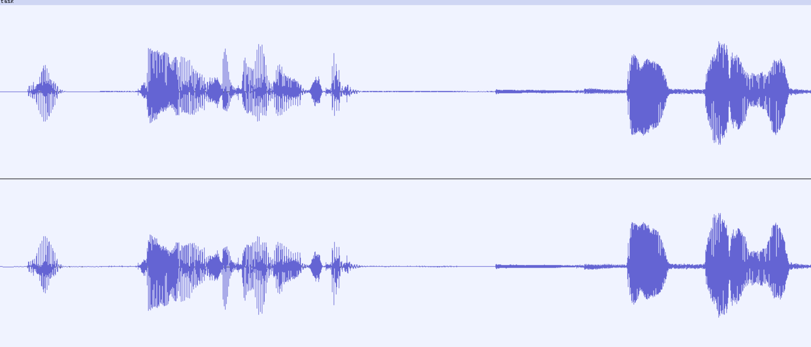
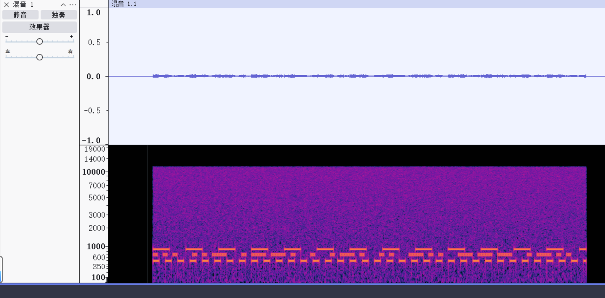

# SU_chaos

## 明文攻击

附件给的是zipCrypto-store

首先需要分析avif的开头

通常开头是000000,第四字节是长度数值的低位部分，不是固定的

同时后部分可区分的就是avif和avis，因此尝试

用

```powershell
bkcrack -C attachment.zip -c challenge.avif -x 4 66747970617669730000000061766973
bkcrack 1.7.1 - 2024-12-21
[18:30:12] Z reduction using 8 bytes of known plaintext
100.0 % (8 / 8)
[18:30:12] Attack on 786955 Z values at index 11
Keys: b76b3323 6eebbce4 00a94706
21.3 % (167255 / 786955)
Found a solution. Stopping.
You may resume the attack with the option: --continue-attack 167255
[18:30:43] Keys
b76b3323 6eebbce4 00a94706
```

## avif分析

已知是动图

```bash
 ffprobe -v error -show_streams -select_streams v challenge.avif
```

stream 1：`nb_frames=5`持续 5s，明显是5 帧动画流

```bash
ffmpeg -i challenge.avif -map 0:v:1 stream1_%02d.png
```

是个二维码的切割

```bash
montage stream1_02.png stream1_03.png stream1_04.png stream1_05.png -tile 2x2 -geometry +0+0 output.png
```

汉信码

[ToolsBug Barcode Reader](https://toolsbug.github.io/barcode-reader/)

扫描得到

```
0f87b6f831b312a0b6748c4a792b9362c033c75cc230aae63be2c9cfab12a0e4
```

然后分析task

一个wav一个zip

## wav分析

wav的bgm和日语交流没有任何的食用价值，就是要弄个音频搞个声就是了(实际是原来的出题想法没实现被迫改成这个)



用aud打开不难发现左右声道相反(或者脚本分析)那么可以使用aud的分离立体声到单声道，再点击轨道->混音->混音并渲染来实现



打开多视图就可以发现实际就是morse电码手动的恢复一下内容即可,上下两侧为500和900hz的dot，只是想让声音变得尽可能不太明显

或者使用脚本

```python
import wave
import struct

with wave.open("task.wav", "rb") as c:
    with wave.open("solve.wav", "wb") as a:
        a.setnchannels(1)
        a.setsampwidth(1)
        a.setframerate(24000)

        for i in range(c.getnframes()):
            L, R = struct.unpack('hh', c.readframes(1))
            data = L + R

            a_data = struct.pack('h', data)
            a.writeframes(a_data)

```

明文是`SUPERIDOL`

然后使用deepsound提取出文字

得知最后的zip的密码需要解决这个文本

## 中国古典密码

```
A：寒江夜阔云初散，秋灯入梦染空山。潮声拍岸惊归鹤，旧径松深客未还。
B：星沉古岸月微寒，竹林深锁远钟音。长江如练横天际，画舟轻渡入云岚。
A：你刚写的那几句，我真挺喜欢的，看着很安静。
B：真的？我还怕有点太那个了。你那句一下就把情绪点出来了。
A：可能就是那一瞬间的感觉吧，说不清楚，但心里动了一下。
B：我也是。读你的时候，会有种“哦，他懂这个”的感觉，挺难得的。
A：那还是老样子，以诗做表相切，一二三四，阴阳上去，定为声调
A：
3-21-1
10-21-4
13-7-4
2-9-4
15-15-2
0-28-1
28-22-1
B：甚好，待等有缘人探所之文，寻我二者之密
```

唯一的提示就是在`以诗做表相切，一二三四，阴阳上去，定为声调`，考察的其实就是声母韵母声调的拼接实现的反切

[反切注韵法](https://www.wolai.com/m3p_cl/47dD1mWp1wKmX94ix8TKaj)

https://zh-classical.wikipedia.org/wiki/%E5%8F%8D%E5%88%87

https://zhuanlan.zhihu.com/p/25247091

**声母映射表**

```
寒江夜阔云初散，秋灯入梦染空山。潮声拍岸惊归鹤，旧径松深客未还。
```

| 原文 | 声母      | 索引 |
| ---- | --------- | ---- |
| 寒   | h         | 1    |
| 江   | j         | 2    |
| 夜   | 零声母(y) | 3    |
| 阔   | k         | 4    |
| 云   | 零声母(y) | 5    |
| 初   | ch        | 6    |
| 散   | s         | 7    |
| 秋   | q         | 8    |
| 灯   | d         | 9    |
| 入   | r         | 10   |
| 梦   | m         | 11   |
| 染   | r         | 12   |
| 空   | k         | 13   |
| 山   | sh        | 14   |
| 潮   | ch        | 15   |
| 声   | sh        | 16   |
| 拍   | p         | 17   |
| 岸   | 零声母    | 18   |
| 惊   | j         | 19   |
| 归   | g         | 20   |
| 鹤   | h         | 21   |
| 旧   | j         | 22   |
| 径   | j         | 23   |
| 松   | s         | 24   |
| 深   | sh        | 25   |
| 客   | k         | 26   |
| 未   | w         | 27   |
| 还   | h         | 28   |

**韵母映射表**

```
星沉古岸月微寒，竹林深锁远钟音。长江如练横天际，画舟轻渡入云岚。
```

| 原文 | 韵母 | 索引 |
| ---- | ---- | ---- |
| 星   | ing  | 1    |
| 沉   | en   | 2    |
| 古   | u    | 3    |
| 岸   | an   | 4    |
| 月   | ue   | 5    |
| 微   | ei   | 6    |
| 寒   | an   | 7    |
| 竹   | u    | 8    |
| 林   | in   | 9    |
| 深   | en   | 10   |
| 锁   | uo   | 11   |
| 远   | uan  | 12   |
| 钟   | ong  | 13   |
| 音   | in   | 14   |
| 长   | ang  | 15   |
| 江   | iang | 16   |
| 如   | u    | 17   |
| 练   | ian  | 18   |
| 横   | eng  | 19   |
| 天   | ian  | 20   |
| 际   | i    | 21   |
| 画   | ua   | 22   |
| 舟   | ou   | 23   |
| 轻   | ing  | 24   |
| 渡   | u    | 25   |
| 入   | u    | 26   |
| 云   | un   | 27   |
| 岚   | an   | 28   |

按照题目给的信息得到了

```
3-21-1
10-21-4
13-7-4
2-9-4
15-15-2
0-28-1
28-22-1
```

```
yī rì kàn jìn cháng ān huā
```

一日看尽长安花

MD5值

```
echo -n "一日看尽长安花" |md5sum
2e4dc1dad6e4c0747371a041cb177dd7  -
```

## zip分析

flag.txt的内容是zip的hash

备注给的是hash压缩包16进制的密钥

```
$zip2$*0*3*0*ee1f6cc09449ea4174cb45bd0d667d1c*258b*1c*0a6bd41815d0d2af8b30c25ce506b2ead194b0f3c4186913c80d2a2b*408973cbd18faafa7355*$/zip2$
```

联系汉信码提供的内容

```python
import binascii, zlib
from Crypto.Cipher import AES
from Crypto.Util import Counter

PAYLOAD_HEX = "0a6bd41815d0d2af8b30c25ce506b2ead194b0f3c4186913c80d2a2b"
KEY_HEX     = "0f87b6f831b312a0b6748c4a792b9362c033c75cc230aae63be2c9cfab12a0e4"

ctr = Counter.new(128, initial_value=1, little_endian=True)
raw = AES.new(binascii.unhexlify(KEY_HEX), AES.MODE_CTR, counter=ctr) \
         .decrypt(binascii.unhexlify(PAYLOAD_HEX))

try:
    raw = zlib.decompress(raw, -15)
except zlib.error:
    pass

print(raw.decode('utf-8', errors='replace'))
```

得到flag的内容

```
SUCTF{f4ll1g_t0_the_C6a0s}
```

能反推的原因是文件只有几十字节，所有数据都存储hash里，即"data in hash"常见的zipcrypto和aes诸如此情况都可以解压