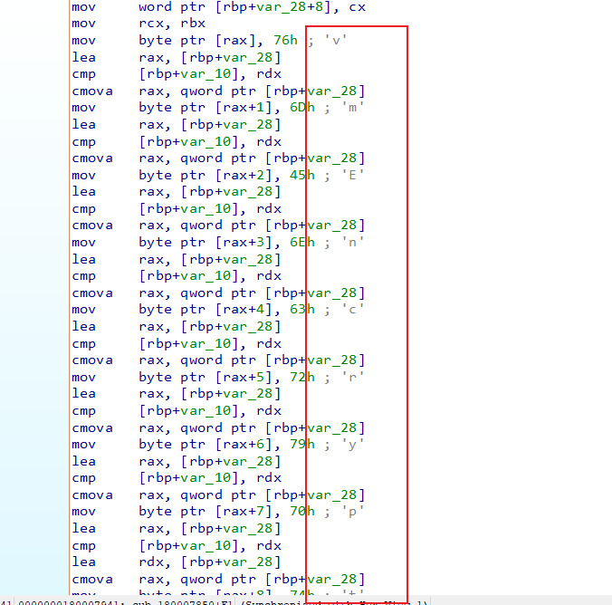
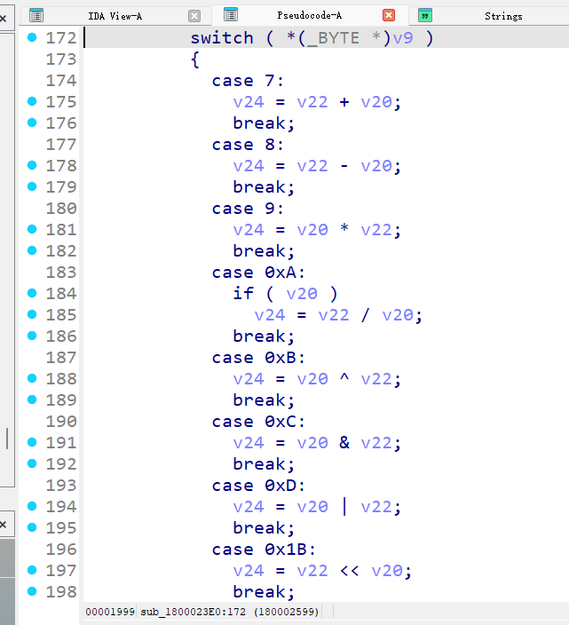
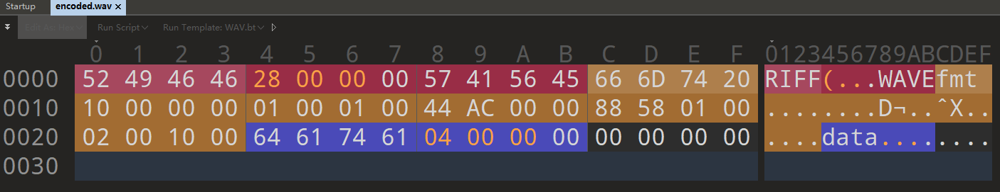
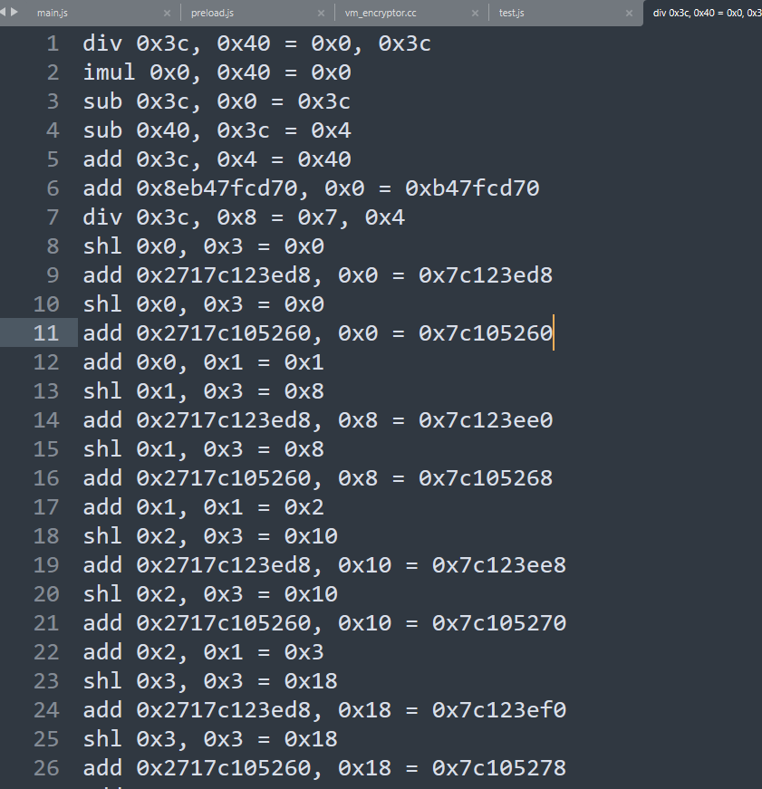

# SU_MvsicPlayer

> Suer wrote a music player that only supports a custom audio format. For security reasons, the player encrypts the music file when it is closed or finishes playing.
>
> Unfortunately, he failed to recover the music file. Can you recover the original .su_mv file?
>
> Flag format: ~~SUCTF{md5(original .su_mv file)}~~ SUCTF{md5(wav file)}

题目提供了一个win-unpacked.zip和ddd.su_mv_enc，其中win-unpacked里是Electron打包的一个可执行文件，了解Electron逆向的可以知道真正的逻辑不在那个很大的exe中，而是在resources目录下的app.asar中

app.asar可以直接作为压缩包解压，解压后可以看到`native`、`src`、`main.js`、`preload.js`等目录文件，其中的js文件全部被混淆了，但混淆手法非常简单，可以借助[在线js反混淆](https://js-deobfuscator.vercel.app/)基本还原逻辑

main.js如下

~~~js
const {
  app,
  BrowserWindow,
  dialog,
  ipcMain
} = require("electron");
const fs2 = require("fs");
const path2 = require("path");
const {
  createVmEncryptorBridge
} = require("./src/main/native-bridge");
const vCreateVmEncryptorBridge = createVmEncryptorBridge(__dirname);
const vO = {
  secureEnabled: false,
  currentSuMvPath: "",
  currentPayload: null,
  archivedPaths: new Set()
};
let v = null;
let v2 = false;
let v3 = false;
function f(p) {
  if (!p) {
    return null;
  }
  if (Buffer.isBuffer(p)) {
    return p;
  }
  if (p instanceof Uint8Array) {
    return Buffer.from(p);
  }
  if (p instanceof ArrayBuffer) {
    return Buffer[_0x144f32(3)](new Uint8Array(p));
  }
  if (ArrayBuffer.isView(p)) {
    return Buffer.from(p[_0x144f32(5)], p.byteOffset, p[_0x144f32(6)]);
  }
  if (p && Array.isArray(p.data)) {
    return Buffer[_0x144f32(3)](p[_0x144f32(7)]);
  }
  return null;
}
async function f2(p2, p3) {
  if (!p2 || !Buffer.isBuffer(p3) || p3.length === 0) {
    return {
      ok: false
    };
  }
  if (vO.archivedPaths.has(p2)) {
    return {
      ok: true,
      skipped: true
    };
  }
  if (!fs2.existsSync(p2)) {
    return {
      ok: false
    };
  }
  const v4 = vCreateVmEncryptorBridge.vmEncrypt(p3);
  const v5 = p2 + "_enc";
  await fs2.promises.writeFile(v5, v4);
  await fs2.promises.unlink(p2);
  vO.archivedPaths.add(p2);
  return {
    ok: true,
    outputPath: v5
  };
}
async function f3() {
  if (!vO.secureEnabled || !vO.currentSuMvPath || vO.archivedPaths.has(vO.currentSuMvPath)) {
    return {
      ok: true,
      skipped: true
    };
  }
  if (v3) {
    return {
      ok: true,
      skipped: true
    };
  }
  v3 = true;
  try {
    return await f2(vO[_0x25410d(12)], vO.currentPayload);
  } finally {
    v3 = false;
  }
}
function f4() {
  v = new BrowserWindow({
    width: 620,
    height: 500,
    minWidth: 460,
    minHeight: 380,
    webPreferences: {
      preload: path2.join(__dirname, "preload.js"),
      nodeIntegration: false,
      contextIsolation: true,
      sandbox: false
    }
  });
  v.loadFile(path2.join(__dirname, "src/renderer/index.html"));
  v.on("close", p4 => {
    if (v2) {
      return;
    }
    if (!vO.secureEnabled || !vO.currentSuMvPath) {
      return;
    }
    p4.preventDefault();
    f3().catch(() => {}).finally(() => {
      v2 = true;
      v.close();
    });
  });
}
function f5() {
  ipcMain.handle("dialog:open-su-mv", async () => {
    const v6 = await dialog.showOpenDialog({
      title: "Open .su_mv File",
      properties: ["openFile"],
      filters: [{
        name: "SU_MV",
        extensions: ["su_mv"]
      }]
    });
    if (v6.canceled || v6.filePaths.length === 0) {
      return "";
    }
    return v6.filePaths[0];
  });
  ipcMain.handle("file:read-binary", async (p5, p6) => {
    const v7 = await fs2.promises.readFile(p6);
    return new Uint8Array(v7);
  });
  ipcMain.handle("session:update", async (p7, {
    secureEnabled: _0x356adb,
    currentSuMvPath: _0x51c4b5,
    currentPayload: _0x436a7a
  }) => {
    vO.secureEnabled = Boolean(_0x356adb);
    vO.currentSuMvPath = _0x51c4b5 || "";
    vO.currentPayload = f(_0x436a7a);
    return {
      ok: true
    };
  });
  ipcMain.handle("playback:ended", async () => {
    return f3();
  });
  ipcMain.handle("secure:archive-now", async (p8, p9) => {
    return f2(p9, vO.currentPayload);
  });
}
app.whenReady().then(() => {
  f5();
  f4();
  app.on("activate", () => {
    if (BrowserWindow.getAllWindows().length === 0) {
      v2 = false;
      f4();
    }
  });
});
app.on("window-all-closed", () => {
  if (process.platform !== "darwin") {
    app[_0x554535(33)]();
  }
});
~~~

可以发现实现了IPC进程通信，可以发现关键逻辑在f3和f2，f3做了一些检查，如secureEnabled、currentSuMvPath等，满足后调用了f2，f2又调用vCreateVmEncryptorBridge.vmEncrypt对文件内容做了加密，返回结果写入 `文件名_enc`，因此ddd.su_mv_enc的原始文件是ddd.su_mv。

preload.js如下，只是注册了一些api

~~~js
const {
  contextBridge,
  ipcRenderer
} = require("electron");
contextBridge.exposeInMainWorld("suPlayerApi", {
  openSuMvDialog: () => ipcRenderer[_0x55c6fb(3)](_0x55c6fb(4)),
  readBinaryFile: p => ipcRenderer.invoke(_0x55c6fb(5), p),
  updateSession: ({
    secureEnabled: _0x125f4e,
    currentSuMvPath: _0x13fb69,
    currentPayload: _0x1e14ee
  }) => ipcRenderer.invoke(_0x55c6fb(6), {
    secureEnabled: _0x125f4e,
    currentSuMvPath: _0x13fb69,
    currentPayload: _0x1e14ee
  }),
  notifyPlaybackEnded: () => ipcRenderer[_0x55c6fb(3)]("playback:ended"),
  archiveNow: p2 => ipcRenderer[_0x55c6fb(3)](_0x55c6fb(7), p2)
});
~~~

src/main下native-bridge.js去除混淆后如下

~~~js
const fs2 = require("fs");
const path2 = require("path");
function f(p, p2) {
  const v = p2 & 7;
  return (p << v | p >>> 8 - v) & 255;
}
function f2(p3) {
  const v2 = Buffer.from(p3);
  const v3 = Buffer.alloc(v2.length);
  let vLN109 = 109;
  for (let vLN0 = 0; vLN0 < v2.length; vLN0 += 1) {
    vLN109 = (vLN109 ^ 50 + (vLN0 & 15)) & 255;
    v3[vLN0] = f(v2[vLN0] ^ vLN109, vLN0 % 5 + 1);
  }
  const v4 = Buffer.alloc(4);
  v4.write("SVE4", 0, "ascii");
  return Buffer.concat([v4, v3]);
}
function f3(p4) {
  const vA = [path2.join(p4, "native", "build", "Release", "vm_encryptor.node"), path2.join(process.resourcesPath || "", "app.asar.unpacked", "native", "build", "Release", "vm_encryptor.node"), path2.join(process.resourcesPath || "", "native", "build", "Release", "vm_encryptor.node")];
  const v5 = vA.find(p5 => p5 && fs2.existsSync(p5));
  let v6 = null;
  if (!v5) {
    return {};
  }
  v6 = require(v5);
  function f4() {
    throw new Error("E");
  }
  function f5(p6) {
    if (v6 && typeof v6.vmEncrypt === "function") {
      const v7 = v6[_0x2ca98d(12)](Buffer[_0x2ca98d(0)](p6));
      if (Buffer[_0x2ca98d(13)](v7)) {
        return v7;
      }
      f4();
    }
    return f2(p6);
  }
  return {
    vmEncrypt: f5
  };
}
module.exports = {
  createVmEncryptorBridge: f3,
  placeholderVmEncrypt: f2
};
~~~

可知真正的加密逻辑来自native的vm_encryptor.node，如果不存在就会走f2

接下来我们只需关注native层的vmEncrypt函数，strings搜索vmencrypt没有搜索到，但既然函数是导出的我们可以查看Exports，在napi_register_module_v1中找到

~~~c++
__int64 __fastcall napi_register_module_v1(__int64 a1, __int64 a2)
{
  int function; // eax
  __int64 v5; // r8
  __int64 v6; // r9
  __int64 v7; // rcx
  __int64 v9; // [rsp+50h] [rbp+18h] BYREF
  __int64 v10; // [rsp+58h] [rbp+20h]

  function = napi_create_function(a1, 0LL, 0LL, sub_180007380);
  v7 = a1;
  if ( function )
    goto LABEL_2;
  if ( !sub_180007850(a1, a2, v5, v6, 0, v10) )
  {
    v7 = a1;
LABEL_2:
    napi_throw_error(v7, 0LL, "E");
    napi_get_undefined(a1, &v9);
    return v9;
  }
  return a2;
}
~~~

sub_180007850里发现vmEncrypt

结合api napi_create_function可知sub_180007380是真正的加密逻辑

~~~c++
__int64 __fastcall sub_180007380(__int64 a1, __int64 a2)
{
  unsigned __int16 v2; // r15
  __int64 v4; // rcx
  __int64 v6; // r14
  __int16 v7; // r12
  __int16 v8; // si
  __int16 v9; // r13
  __int64 v10; // rdx
  unsigned __int64 v11; // rcx
  int v12; // r8d
  unsigned __int64 v13; // r10
  __int64 v14; // rdx
  bool v15; // cf
  unsigned __int64 v16; // r8
  __int64 v17; // rdi
  _BYTE *v18; // rbx
  _BYTE *v19; // rsi
  __int64 v20; // rax
  void *v21; // rcx
  _BYTE *v22; // rax
  char v23; // [rsp+30h] [rbp-59h]
  unsigned __int64 v24; // [rsp+38h] [rbp-51h]
  LPVOID lpMem[2]; // [rsp+40h] [rbp-49h] BYREF
  __int64 v26; // [rsp+50h] [rbp-39h]
  __int64 v27; // [rsp+58h] [rbp-31h] BYREF
  __int64 v28; // [rsp+60h] [rbp-29h] BYREF
  unsigned __int8 *v29; // [rsp+68h] [rbp-21h] BYREF
  unsigned __int64 v30; // [rsp+70h] [rbp-19h] BYREF
  unsigned __int64 v31; // [rsp+78h] [rbp-11h]
  __int64 v32; // [rsp+80h] [rbp-9h] BYREF
  __int64 v33; // [rsp+88h] [rbp-1h] BYREF
  _QWORD v34[4]; // [rsp+90h] [rbp+7h] BYREF
  char v35; // [rsp+100h] [rbp+77h] BYREF
  __int64 v36; // [rsp+108h] [rbp+7Fh] BYREF

  v2 = 0;
  v27 = 1LL;
  napi_get_cb_info(a1, a2, &v27, &v28, 0LL, 0LL);
  v4 = a1;
  if ( v27 && (v35 = 0, napi_is_buffer(a1, v28, &v35), v4 = a1, v35) )
  {
    v29 = 0LL;
    v30 = 0LL;
    napi_get_buffer_info(a1, v28, &v29, &v30);
    v6 = 0LL;
    v26 = 0LL;
    *(_OWORD *)lpMem = 0LL;
    if ( v29
      && v30 >= 0x2C
      && (*v29 | ((v29[1] | (*((unsigned __int16 *)v29 + 1) << 8)) << 8)) == 'FFIR'
      && (v29[8] | ((v29[9] | (*((unsigned __int16 *)v29 + 5) << 8)) << 8)) == 'EVAW' )
    {
      LOBYTE(v36) = 0;
      v7 = 0;
      v23 = 0;
      v8 = 0;
      v31 = 0LL;
      v9 = 0;
      v24 = 0LL;
      v10 = 12LL;
      v11 = 20LL;
      while ( 1 )
      {
        v12 = v29[v10] | ((v29[v10 + 1] | (*(unsigned __int16 *)&v29[v10 + 2] << 8)) << 8);
        LODWORD(v13) = v29[v10 + 4] | ((v29[v10 + 5] | (*(unsigned __int16 *)&v29[v10 + 6] << 8)) << 8);
        if ( v11 > v30 )
          break;
        v14 = (unsigned int)v13;
        if ( (unsigned int)v13 > v30 - v11 )
          break;
        if ( v12 == ' tmf' )
        {
          v15 = (unsigned int)v13 < 0x10;
          v13 = v24;
          if ( !v15 )
          {
            v7 = *(_WORD *)&v29[v11];
            v8 = *(_WORD *)&v29[v11 + 2];
            v2 = *(_WORD *)&v29[v11 + 12];
            v9 = *(_WORD *)&v29[v11 + 14];
            LOBYTE(v36) = 1;
          }
        }
        else if ( v12 == 'atad' )
        {
          v31 = v11;
          v13 = (unsigned int)v13;
          v24 = (unsigned int)v13;
          v23 = 1;
        }
        else
        {
          v13 = v24;
        }
        v16 = v14 + (v14 & 1);
        if ( v16 > v30 - v11 )
          break;
        v10 = v16 + v11;
        v11 += v16 + 8;
        if ( v11 > v30 )
        {
          if ( !(_BYTE)v36
            || !v23
            || v7 != 1
            || v9 != 16
            || (unsigned __int16)(v8 - 1) > 7u
            || v2 != 2 * v8
            || v2 < 2u
            || !v13
            || v13 % v2
            || v31 > v30
            || v13 > v30 - v31 )
          {
            break;
          }
          if ( !(unsigned __int8)sub_180001380(v29, v30, lpMem) )
          {
            napi_throw_error(a1, 0LL, "E");
            napi_get_undefined(a1, &v36);
            v17 = v36;
            v6 = v26;
            v18 = lpMem[0];
            goto LABEL_44;
          }
          v6 = v26;
          v19 = lpMem[1];
          v18 = lpMem[0];
          goto LABEL_41;
        }
      }
    }
    v20 = sub_180001150(v34, v29, v30);
    if ( lpMem == (LPVOID *)v20 )
    {
      v19 = lpMem[1];
      v18 = lpMem[0];
    }
    else
    {
      v18 = *(_BYTE **)v20;
      v19 = *(_BYTE **)(v20 + 8);
      v6 = *(_QWORD *)(v20 + 16);
      *(_QWORD *)v20 = 0LL;
      *(_QWORD *)(v20 + 8) = 0LL;
      *(_QWORD *)(v20 + 16) = 0LL;
    }
    v21 = (void *)v34[0];
    if ( v34[0] )
    {
      if ( v34[2] - v34[0] >= 0x1000uLL )
      {
        v21 = *(void **)(v34[0] - 8LL);
        if ( (unsigned __int64)(v34[0] - (_QWORD)v21 - 8LL) > 0x1F )
        {
          sub_18000CB6C();
          JUMPOUT(0x18000784ALL);
        }
      }
      sub_18000905C(v21);
    }
LABEL_41:
    v32 = 0LL;
    if ( (unsigned int)napi_create_buffer_copy(a1, v19 - v18, v18, &v32, &v33) )
    {
      napi_throw_error(a1, 0LL, "E");
      napi_get_undefined(a1, &v36);
      v17 = v36;
    }
    else
    {
      v17 = v33;
    }
LABEL_44:
    if ( v18 )
    {
      v22 = v18;
      if ( (unsigned __int64)(v6 - (_QWORD)v18) >= 0x1000 )
      {
        v18 = (_BYTE *)*((_QWORD *)v18 - 1);
        if ( (unsigned __int64)(v22 - v18 - 8) > 0x1F )
        {
          sub_18000CB6C();
          __debugbreak();
        }
      }
      sub_18000905C(v18);
    }
    return v17;
  }
  else
  {
    napi_throw_error(v4, 0LL, "E");
    napi_get_undefined(a1, &v36);
    return v36;
  }
}
~~~

函数检查了wav格式（WAVE、RIFF、fmt、data等字眼），全部满足会走到sub_180001380，不满足会走sub_180001150（结合音乐播放器功能可知wav是肯定满足的，这里不用去分析了）。关键看sub_180001380

~~~c++
char __fastcall sub_180001380(_QWORD *a1, unsigned __int64 a2, _QWORD *a3)
{
  // [COLLAPSED LOCAL DECLARATIONS. PRESS NUMPAD "+" TO EXPAND]

  v32 = a3;
  v3 = a3;
  v34 = a1;
  if ( a3 )
  {
    if ( a1 )
    {
      if ( a2 <= 0xFFFFFFFFFFFFFFBFuLL )
      {
        v5 = a2 + 64;
LABEL_7:
        if ( v5 > 0x7FFFFFFFFFFFFFFFLL )
          std::vector<void *>::_Xlen();
        if ( v5 < 0x1000 )
        {
          v8 = (_QWORD *)sub_180008CA8(v5);
          v6 = a2 + 103;
        }
        else
        {
          v6 = v5 + 39;
          if ( v5 + 39 < v5 )
            goto LABEL_78;
          v7 = sub_180008CA8(v5 + 39);
          if ( !v7 )
            goto LABEL_77;
          v8 = (_QWORD *)((v7 + 39) & 0xFFFFFFFFFFFFFFE0uLL);
          *(v8 - 1) = v7;
        }
        v9 = (char *)v8 + v5;
        sub_180015960(v8, 0LL, v5);
        if ( v5 < 0x1000 )
        {
          v11 = (_QWORD *)sub_180008CA8(v5);
          goto LABEL_18;
        }
        if ( v6 > v5 )
        {
          v10 = sub_180008CA8(v6);
          if ( !v10 )
            goto LABEL_77;
          v11 = (_QWORD *)((v10 + 39) & 0xFFFFFFFFFFFFFFE0uLL);
          *(v11 - 1) = v10;
LABEL_18:
          v12 = (char *)v11 + v5;
          sub_180015960(v11, 0LL, v5);
          if ( dword_180023CD0 > *(_DWORD *)(*((_QWORD *)NtCurrentTeb()->ThreadLocalStoragePointer
                                             + (unsigned int)TlsIndex)
                                           + 4LL) )
          {
            sub_180008C2C(&dword_180023CD0);
            if ( dword_180023CD0 == -1 )
            {
              atexit(sub_180016A00);
              sub_180008BC0(&dword_180023CD0);
            }
          }
          if ( !byte_180023CB4 )
          {
            sub_180002E00(v35);
            v13 = sub_180001D90(v35);
            v14 = (void *)v35[0];
            byte_180023CB5 = v13;
            byte_180023CB4 = 1;
            if ( v35[0] )
            {
              if ( v35[2] - v35[0] >= 0x1000uLL )
              {
                v14 = *(void **)(v35[0] - 8LL);
                if ( (unsigned __int64)(v35[0] - (_QWORD)v14 - 8LL) > 0x1F )
                {
                  sub_18000CB6C();
                  JUMPOUT(0x1800019A1LL);
                }
              }
              sub_18000905C(v14);
            }
          }
          if ( byte_180023CB5 )
          {
            sub_180015960(v48, 0LL, 232LL);
            v16 = v34;
            v37 = 0LL;
            v43 = 0;
            v45 = 0LL;
            v42 = v48;
            v17 = 0LL;
            v44 = 0LL;
            v46 = 0LL;
            v47 = 0LL;
            v41 = v34;
            v40 = a2;
            v39 = v8;
            v38 = v11;
            memset(v36, 0, sizeof(v36));
            if ( (unsigned __int64)(_mm_srli_si128((__m128i)0LL, 8).m128i_i64[0] >> 3) < 0x800 )
            {
              v18 = (__int64)v45 >> 3;
              v19 = sub_180008CA8(16423LL);
              if ( !v19 )
                goto LABEL_77;
              v20 = (v19 + 39) & 0xFFFFFFFFFFFFFFE0uLL;
              *(_QWORD *)(v20 - 8) = v19;
              sub_180015D20(v20, v44, v45 - (_QWORD)v44);
              v21 = v44;
              if ( v44 )
              {
                if ( ((*((_QWORD *)&v45 + 1) - (_QWORD)v44) & 0xFFFFFFFFFFFFFFF8uLL) >= 0x1000 )
                {
                  v21 = (_BYTE *)*((_QWORD *)v44 - 1);
                  if ( (unsigned __int64)(v44 - v21 - 8) > 0x1F )
                    goto LABEL_77;
                }
                sub_18000905C(v21);
              }
              v17 = v47;
              v22 = v20 + 8 * v18;
              v3 = v32;
              *(_QWORD *)&v45 = v22;
              v23 = v20 + 0x4000;
              v44 = (_BYTE *)v20;
              v16 = v34;
              *((_QWORD *)&v45 + 1) = v23;
            }
            v24 = *((_QWORD *)&v46 + 1);
            v32 = v48;
            v33 = 232LL;
            if ( *((_QWORD **)&v46 + 1) == v17 )
            {
              sub_1800082E0(&v46, *((_QWORD *)&v46 + 1), &v32);
              v25 = (_QWORD *)*((_QWORD *)&v46 + 1);
            }
            else
            {
              **((_QWORD **)&v46 + 1) = v48;
              *(_QWORD *)(v24 + 8) = 232LL;
              v25 = (_QWORD *)(*((_QWORD *)&v46 + 1) + 16LL);
              *((_QWORD *)&v46 + 1) += 16LL;
            }
            if ( a2 )
            {
              v32 = v16;
              v33 = a2;
              if ( v25 == v47 )
              {
                sub_1800082E0(&v46, v25, &v32);
                v25 = (_QWORD *)*((_QWORD *)&v46 + 1);
              }
              else
              {
                *v25 = v16;
                v25[1] = a2;
                v25 = (_QWORD *)(*((_QWORD *)&v46 + 1) + 16LL);
                *((_QWORD *)&v46 + 1) += 16LL;
              }
            }
            v32 = v8;
            v33 = v9 - (char *)v8;
            if ( v25 == v47 )
            {
              sub_1800082E0(&v46, v25, &v32);
              v26 = (_QWORD *)*((_QWORD *)&v46 + 1);
            }
            else
            {
              *v25 = v8;
              v25[1] = v9 - (char *)v8;
              v26 = (_QWORD *)(*((_QWORD *)&v46 + 1) + 16LL);
              *((_QWORD *)&v46 + 1) += 16LL;
            }
            v32 = v11;
            v27 = v12 - (char *)v11;
            v33 = v12 - (char *)v11;
            if ( v26 == v47 )
            {
              sub_1800082E0(&v46, v26, &v32);
            }
            else
            {
              *v26 = v11;
              v26[1] = v27;
              *((_QWORD *)&v46 + 1) += 16LL;
            }
            if ( a2 <= 0xFFFFFFFFFFFFFFLL
              && (unsigned __int8)sub_1800023E0(&lpMem, v36, (a2 << 8) + 10000000)
              && v48[0]
              && v48[0] <= v27
              && (v48[0] & 0x3F) == 0 )
            {
              v31[0] = 0;
              sub_180007A90(v3, v48[0] + 4LL, v31);
              *(_BYTE *)*v3 = 83;
              *(_BYTE *)(*v3 + 1LL) = 86;
              *(_BYTE *)(*v3 + 2LL) = 69;
              *(_BYTE *)(*v3 + 3LL) = 52;
              if ( v48[0] )
                sub_180015D20(*v3 + 4LL, v11, v48[0]);
              v15 = 1;
            }
            else
            {
              v15 = 0;
            }
            v28 = (void *)v46;
            if ( (_QWORD)v46 )
            {
              if ( ((unsigned __int64)((unsigned __int64)v47 - v46) & 0xFFFFFFFFFFFFFFF0uLL) >= 0x1000 )
              {
                v28 = *(void **)(v46 - 8);
                if ( (unsigned __int64)(v46 - (_QWORD)v28 - 8) > 0x1F )
                  goto LABEL_77;
              }
              sub_18000905C(v28);
              v47 = 0LL;
              v46 = 0LL;
            }
            v29 = v44;
            if ( v44 )
            {
              if ( ((*((_QWORD *)&v45 + 1) - (_QWORD)v44) & 0xFFFFFFFFFFFFFFF8uLL) >= 0x1000 )
              {
                v29 = (_BYTE *)*((_QWORD *)v44 - 1);
                if ( (unsigned __int64)(v44 - v29 - 8) > 0x1F )
                  goto LABEL_77;
              }
              sub_18000905C(v29);
              v44 = 0LL;
              v45 = 0LL;
            }
          }
          else
          {
            v15 = 0;
          }
          if ( v11 )
          {
            if ( (unsigned __int64)(v12 - (char *)v11) >= 0x1000 )
            {
              if ( (unsigned __int64)v11 - *(v11 - 1) - 8 > 0x1F )
                goto LABEL_77;
              v11 = (_QWORD *)*(v11 - 1);
            }
            sub_18000905C(v11);
          }
          if ( !v8 )
            return v15;
          if ( (unsigned __int64)(v9 - (char *)v8) < 0x1000 )
          {
LABEL_74:
            sub_18000905C(v8);
            return v15;
          }
          if ( (unsigned __int64)v8 - *(v8 - 1) - 8 <= 0x1F )
          {
            v8 = (_QWORD *)*(v8 - 1);
            goto LABEL_74;
          }
LABEL_77:
          sub_18000CB6C();
          __debugbreak();
        }
LABEL_78:
        sub_180001130();
      }
    }
    else if ( !a2 )
    {
      v5 = 64LL;
      goto LABEL_7;
    }
  }
  return 0;
}
~~~

代码可读性非常差，但不用管我们只需要去找到vm实现的逻辑

sub_180002E00中发现做了类似初始化vm code的操作，sub_1800023E0里发现了vm指令实现

因此接下来我们可以自己模拟js调用vm_encryptor.node，传入一个wav，随便找一个wav修改下data数据长度和data数据

构造js脚本

~~~js
const fs = require('fs');
const mod = require('./native/build/Release/vm_encryptor.node');
const plain = fs.readFileSync("encoded.wav");

fs.writeFileSync('vmout', mod.vmEncrypt(plain));
~~~

发现文件多了个`SVM4`头，而且去掉头部后的长度从48扩充到了64，经过修改data数据可以发现加密是以64字节为一组

接下来可以下条件断点把所有可能汇编指令运算打印出来

我们按照一组64字节来分析算法，可以ai分析也可以自己手撕！

这里只简单说下vm思路，算法不再分析，解密脚本如下

~~~python
import struct

BLOCK_SIZE = 64
MASK32 = 0xFFFFFFFF
DELTA = 0x70336364

ALPHA = 8
BETA = 3

def ror32(x, r):
    r &= 31
    return ((x >> r) | (x << (32 - r))) & MASK32

def rol32(x, r):
    r &= 31
    return ((x << r) | (x >> (32 - r))) & MASK32

def words_be(b):
    if len(b) % 4:
        raise ValueError("length must be multiple of 4")
    return list(struct.unpack(">" + "I" * (len(b) // 4), b))

def bytes_be(ws):
    return struct.pack(">" + "I" * len(ws), *[w & MASK32 for w in ws])

def speck_pair(x, y, k):
    x = ror32(x, ALPHA)
    x = (x + y) & MASK32
    x ^= k
    y = rol32(y, BETA)
    y ^= x
    return x, y

def speck_pair_inv(x, y, k):
    y ^= x
    y = ror32(y, BETA)
    x ^= k
    x = (x - y) & MASK32
    x = rol32(x, ALPHA)
    return x, y

def expand_key(key32, rounds):
    if len(key32) != 32:
        raise ValueError("key must be 32 bytes")
    a, b, c, d, e, f, g, h = words_be(key32)
    s = 0x73756572
    rks = []
    for r in range(rounds):
        s = (s + DELTA + r) & MASK32
        a = (a + rol32(b ^ s, 3)) & MASK32
        b = (b + rol32(c ^ a, 5)) & MASK32
        c = (c + rol32(d ^ b, 7)) & MASK32
        d = (d + rol32(e ^ c, 11)) & MASK32
        e = (e + rol32(f ^ d, 13)) & MASK32
        f = (f + rol32(g ^ e, 17)) & MASK32
        g = (g + rol32(h ^ f, 19)) & MASK32
        h = (h + rol32(a ^ g, 23)) & MASK32

        rks.append([
            (a ^ c ^ s) & MASK32,
            (b ^ d ^ (s + 0x62616f7a)) & MASK32,
            (e ^ g ^ (s + 0x6f6e6777)) & MASK32,
            (f ^ h ^ (s + 0x696e6221)) & MASK32,
            (a + e) & MASK32,
            (b + f) & MASK32,
            (c + g) & MASK32,
            (d + h) & MASK32,
            (a ^ f) & MASK32,
            (b ^ g) & MASK32,
            (c ^ h) & MASK32,
            (d ^ e) & MASK32,
        ])
    return rks

def F_round(R, rk, s):
    R2 = R[:]
    for p in range(4):
        i = 2 * p
        R2[i], R2[i + 1] = speck_pair(R2[i], R2[i + 1], rk[p])

    Fout = [0] * 8
    for i in range(8):
        ri = R2[i]
        rj = R2[(i + 1) & 7]
        mix = (((ri << 4) ^ (ri >> 5)) + rj) & MASK32
        k = rk[4 + i]
        extra = rol32(R2[(i + 3) & 7], (i + 1) & 31)
        Fout[i] = ((mix ^ (s + k)) + (extra ^ (s >> ((i + 1) & 7)))) & MASK32
    return R2, Fout

def inv_pairmix(R2, rk):
    R = R2[:]
    for p in (3, 2, 1, 0):
        i = 2 * p
        R[i], R[i + 1] = speck_pair_inv(R[i], R[i + 1], rk[p])
    return R

def encrypt_block_64(block64, key32, rounds=4):
    if len(block64) != 64:
        raise ValueError("block must be 64 bytes")
    rks = expand_key(key32, rounds)

    W = words_be(block64)
    L, R = W[:8], W[8:]
    s = 0
    for rk in rks:
        s = (s + DELTA) & MASK32
        R2, Fout = F_round(R, rk, s)
        L, R = R2, [(L[i] ^ Fout[i]) & MASK32 for i in range(8)]
    return bytes_be(L + R)

def decrypt_block_64(block64, key32, rounds=4):
    if len(block64) != 64:
        raise ValueError("block must be 64 bytes")
    rks = expand_key(key32, rounds)

    W = words_be(block64)
    L, R = W[:8], W[8:]

    sums = []
    s = 0
    for _ in range(rounds):
        s = (s + DELTA) & MASK32
        sums.append(s)

    for idx in range(rounds - 1, -1, -1):
        rk = rks[idx]
        s = sums[idx]
        R2 = L

        Fout = [0] * 8
        for i in range(8):
            ri = R2[i]
            rj = R2[(i + 1) & 7]
            mix = (((ri << 4) ^ (ri >> 5)) + rj) & MASK32
            k = rk[4 + i]
            extra = rol32(R2[(i + 3) & 7], (i + 1) & 31)
            Fout[i] = ((mix ^ (s + k)) + (extra ^ (s >> ((i + 1) & 7)))) & MASK32

        L_prev = [(R[i] ^ Fout[i]) & MASK32 for i in range(8)]
        R_prev = inv_pairmix(R2, rk)
        L, R = L_prev, R_prev

    return bytes_be(L + R)

def pkcs7_pad(data, bs=BLOCK_SIZE):
    pad = bs - (len(data) % bs)
    return data + bytes([pad]) * pad

def pkcs7_unpad(data, bs=BLOCK_SIZE):
    if not data or (len(data) % bs):
        raise ValueError("bad padded length")
    pad = data[-1]
    if pad < 1 or pad > bs:
        raise ValueError("bad padding")
    tail = data[-pad:]
    bad = 0
    for b in tail:
        bad |= (b ^ pad)
    if bad:
        raise ValueError("bad padding")
    return data[:-pad]

def derive_next_key32_from_block(block64):
    """用上一轮密文(64B)派生下一轮 key(32B)：前32B XOR 后32B"""
    a = block64[:32]
    b = block64[32:]
    return bytes(x ^ y for x, y in zip(a, b))

def encrypt_key_chaining(plaintext, key32, rounds=4):
    """
    取消 CBC，仅 padding。
    每块用当前 key 加密；下一块 key = f(上一块密文)
    输出：ciphertext（无 IV）
    """
    if len(key32) != 32:
        raise ValueError("key must be 32 bytes")
    pt = pkcs7_pad(plaintext, BLOCK_SIZE)
    out = bytearray()
    k = key32
    mv = memoryview(pt)
    for i in range(0, len(pt), BLOCK_SIZE):
        block = mv[i:i + BLOCK_SIZE].tobytes()
        c = encrypt_block_64(block, k, rounds=rounds)
        out += c
        k = derive_next_key32_from_block(c)
    return bytes(out)

def decrypt_key_chaining(ciphertext, key32, rounds=4):
    """
    解密端同样 key chaining：
    每块用当前 key 解密；下一块 key = f(本块密文)
    """
    if len(key32) != 32:
        raise ValueError("key must be 32 bytes")
    if len(ciphertext) == 0 or (len(ciphertext) % BLOCK_SIZE):
        raise ValueError("ciphertext length must be multiple of 64")
    out = bytearray()
    k = key32
    mv = memoryview(ciphertext)
    for i in range(0, len(ciphertext), BLOCK_SIZE):
        c = mv[i:i + BLOCK_SIZE].tobytes()
        p = decrypt_block_64(c, k, rounds=rounds)
        out += p
        k = derive_next_key32_from_block(c)
    return pkcs7_unpad(bytes(out), BLOCK_SIZE)

if __name__ == "__main__":
    key = bytes(range(32))
    data = open("ddd.su_mv_enc", "rb").read()[4:]
    # ct = encrypt_key_chaining(data, key, rounds=4)
    rt = decrypt_key_chaining(data, key, rounds=4)
~~~

得到wav做md5即为flag

js层其实本来还有一层加密，但出题的时候没限制好导致出现多解