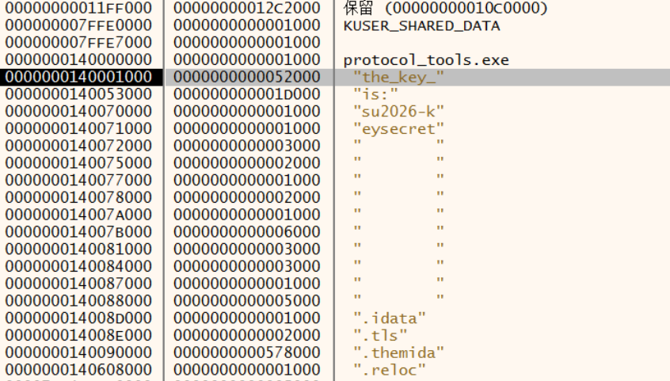

# SU_Protocol

# 前言

此题采取 Themida 静态压缩 + 动态修改密钥 + 预期多解的思路防止 ai 一把梭（被一些师傅骂 misc 了 🥲

# WP

密钥写在段名中，预期解法是 x64dbg 运行时进行 dump，由于 Themida 的原因一定会查看段内存（下断点），所以人类选手（应该）能找到此 key

```cpp
su2026-keysecret
```



> 有个别师傅被 ida 坑了，见下图
> 


## 流程

注册 `/flag` `POST` 路由来接收用户输入


---

整体字段（感谢 r3 的师傅图表做的这么好 :D）

```tsx
Offset  Value         Meaning
------  -----         -------
0       0x60          Magic byte
1-2     0x00 0x7C     Big-endian length = 124
3       0x80          Header byte (from hint)
4       0x55          Type byte (abs(0x55) = 0x55 = type 85)
5       0x00          Default Padding

--- payload ---
6       0x80          Magic byte (must be 0x80)
7-110   [104 bytes]   TEA-encrypted data (13 blocks × 8 bytes)
111-126 [16 bytes]    TEA key = "su2026_keysecret"
---------------

127     [checksum]    (byte3 + byte4 + byte5 + sum(bytes 6..126)) & 0xFF
128     0x16          Trailing byte (from hint)
```

构造 `payload` （使用正确的 key 和 delta 进行 tea 加密）

```tsx
802ba5e6806f7dd07b988241146e350f481ec220fe1536b67193671193ca08060fd065ddf9c197a119d2f732d8c574e7fc8ca862a2a15e3e7312df0fe81b0f810bf27f7f8982b9a1880ac3d3fd128acabe866e82655cb2b536edf8714ec03162c91ed2c534c132a3347375323032362d6b6579736563726574
```

构造整体

```cpp
60 00 7c 80		             55 00 <payload> 45 16
      ^len of payload + 3  ^opcode         ^check sum of(payload + index 3,4,5)
```

```tsx
60007c805500802ba5e6806f7dd07b988241146e350f481ec220fe1536b67193671193ca08060fd065ddf9c197a119d2f732d8c574e7fc8ca862a2a15e3e7312df0fe81b0f810bf27f7f8982b9a1880ac3d3fd128acabe866e82655cb2b536edf8714ec03162c91ed2c534c132a3347375323032362d6b65797365637265744516
```

补上外层 `#` 和 `\n` 之后再做一次 hex string

```cpp
#60007c805500802ba5e6806f7dd07b988241146e350f481ec220fe1536b67193671193ca08060fd065ddf9c197a119d2f732d8c574e7fc8ca862a2a15e3e7312df0fe81b0f810bf27f7f8982b9a1880ac3d3fd128acabe866e82655cb2b536edf8714ec03162c91ed2c534c132a3347375323032362d6b65797365637265744516\x0a
```

```tsx
233630303037633830353530303830326261356536383036663764643037623938383234313134366533353066343831656332323066653135333662363731393336373131393363613038303630666430363564646639633139376131313964326637333264386335373465376663386361383632613261313565336537333132646630666538316230663831306266323766376638393832623961313838306163336433666431323861636162653836366538323635356362326235333665646638373134656330333136326339316564326335333463313332613333343733373533323330333233363264366236353739373336353633373236353734343531360a
```

对该字符串做 md5 即为 flag

flag: `SUCTF{ad1b51464c1b679fe731c7d718af241f}`

## 反调试


当检测父进程为 `explorer.exe` 或 `cmd.exe` 时，对程序进行修补

delta = `0x9E3779B0`

## Other

```cpp
struct ranges // sizeof=0x10
{
    void *start;
    void *end;
};
struct ranges2 // sizeof=0x10
{                                       // XREF: sub_7FF7C5D5F380/r
                                        // sub_7FF7C5D5F3E0/r
    void *start;                        // XREF: sub_7FF7C5D5F380+25/w
                                        // sub_7FF7C5D5F380+38/w ...
    _QWORD len;                         // XREF: sub_7FF7C5D5F380+2E/w
                                        // sub_7FF7C5D5F3E0+2E/w
};
struct __unaligned vec // sizeof=0x18
{                                       // XREF: unpackData/r
                                        // unpackData/r
    _QWORD start;                       // XREF: unpackData+23/r
                                        // unpackData+36/r ...
    _QWORD end;                         // XREF: unpackData+28/r
                                        // unpackData+3B/r ...
    _QWORD len;
};
struct __unaligned ProtocolData // sizeof=0x79
{
    _BYTE flag;
    _DWORD data[26];
    _DWORD key[4];
};
```

### unpackData

编译器做了向量优化，这里可以看出结构体总大小为 121 字节，`105` 和 `23 * 4 + 3` 处有部分重合


### 反序列化

将函数从十六进制字符串转换为 bytes，要求第一个字节为 0x60，然后


可以看出将 payload 写入结构体


补码计算，约束 opcode = 0x55 走正确的 unpackData 逻辑