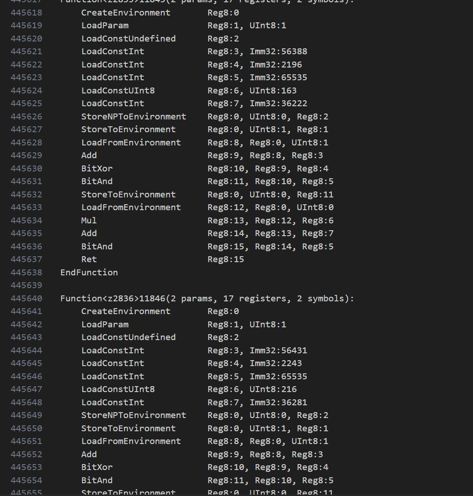
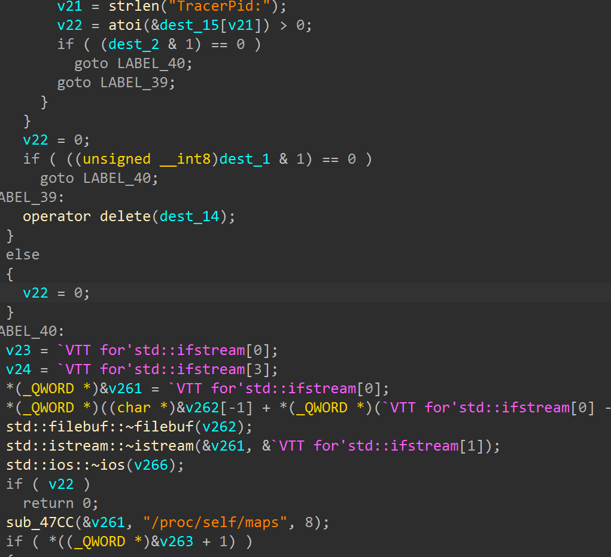
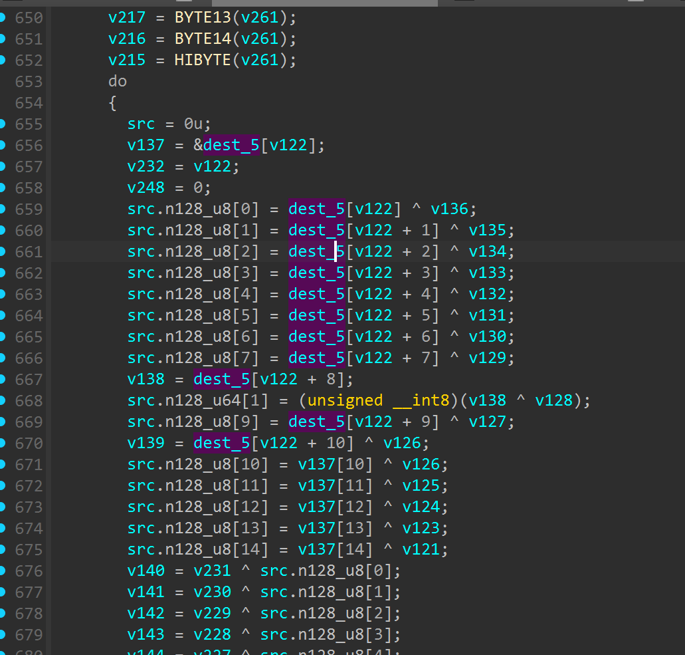
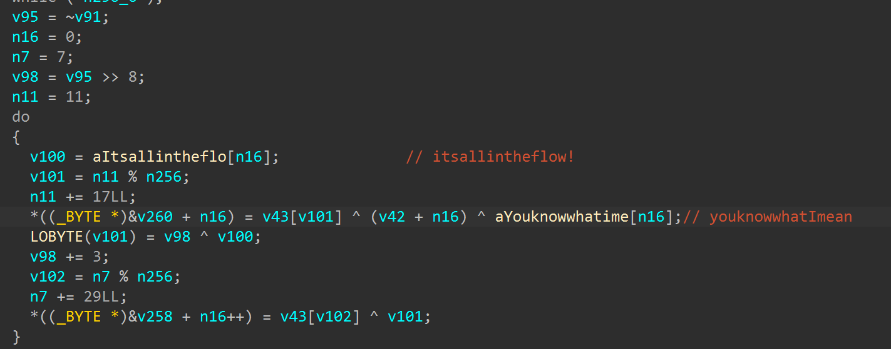

# SU_flumel Writeup

首先给各位做这个题的师傅们道个歉，第一次给XCTF分站赛这么大型的赛事出题，力求不出问题的最后还是出问题了。在与infobahn的师傅们交流该题的时候发现附件存在部分设计失误，故选择更换附件，很抱歉给各位师傅带来了不好的体验。

​                                                      

这个题目总体来说是比较传统的安卓逆向，AI浪潮的到来让我思考如何能在不增加人工解题难度的同时有效抑制AI agent对题目的解出，所以这次出题也是一个尝试，但是好像有些弄巧成拙了。


题目整体逻辑是dart层+Hermes字节码层+Native层进行验证

flutter用了dart vm 3.11.1，blutter恢复符号之后，关于flag的逻辑验证在ctfverify.dart中

整体逻辑是先进行RC4的密钥生成，然后进行自定义的RC4 Warp函数加密，之后传入bundles里的cache.snap.bundle到Native层的qk9v进行验证

build RC4 key还原逻辑如下：

```python
def build_rc4_key():
    arr = [0x1f, 0x3b, 0x3f, 0x03, 0x00, 0x0a, 0xcf,
           0xe5, 0xe7, 0xe8, 0xca, 0xcc, 0xd2]
    out = []
    for i, v in enumerate(arr):
        mask = (9 * i + 0x4b) & 0xff
        out.append(v ^ mask)
    return ''.join(chr(x) for x in out)
```

还原之后的key是：TobeorNottobe

然后是去还原RC4 warp的逻辑，使用blutter提供的addNames.py还原libapp.so的符号，结合ctfverify.dart还原出大致逻辑如下：

```python
int j = 0;
int rot = 0xc3;   

for (int i = 0; i < 256; i++) {
  int k1 = key[(5 * i + 1) % key.length];
  int k2 = key[(3 * i + 7) % key.length];

  rot = ((rot << 1) | (rot >> 7)) & 0xff;   

  j = (j + S[i] + k1 + (k2 ^ rot) + i) & 0xff;
  swap(S[i], S[j]);
}

List<int> process(List<int> input) {
  List<int> out = [];
  int i = 0;
  int j = 0;
  int extra = 157;

  for (int idx = 0; idx < input.length; idx++) {
    int b = input[idx];

    i = (i + 1) & 0xff;
    int si = S[i];

    j = (j + si + 11 * i) & 0xff;
    swap(S[i], S[j]);

    int t1 = (S[i] + si + i + j) & 0xff;
    int a  = S[t1];

    int t2 = (a ^ extra) & 0xff;
    int b2 = S[t2];

    int extraRot = ((extra << 3) | (extra >> 5)) & 0xff;

    int outByte = (b ^ b2 ^ S[(b2 ^ extraRot) & 0xff] ^ ((13 * i) & 0xff)) & 0xff;

    out.add(outByte);
    extra = extraRot;
  }
  return out;
}
```

Native层的逻辑在qk9v这个函数里，然后对于Hermes字节码的有一个加载调用，但只是运行，并没有传参进去，我在编译最后的apk的时候没有把这段预先设计好的加密链路设计到整个的加密流程中，不过对于这个Hermes字节码我们可以看一下。

使用https://github.com/bongtrop/hbctool进行反汇编，这里我们的hbc字节码是hbc90，该仓库的pull requests里提供了90的反编译源码，把其加入到仓库里编译就好了。



反汇编出来的hasm有大概44w行，其实是加了一些静态的无用业务逻辑，形如

````javascript
  function f0(v) {
    var t = ((v + 7) ^ 13) & 0xffff;
    return (t * 4 + 17) & 0xffff;
  }
  if (false) { p = f0(p); }
  function f1(v) {
    var t = ((v + 36) ^ 44) & 0xffff;
    return (t * 41 + 58) & 0xffff;
  }
  if (false) { p = f1(p); }
  function f2(v) {
    var t = ((v + 65) ^ 75) & 0xffff;
    return (t * 78 + 99) & 0xffff;
  }
  if (false) { p = f2(p); }
  function f3(v) {
    var t = ((v + 94) ^ 106) & 0xffff;
    return (t * 115 + 140) & 0xffff;
  }
  if (false) { p = f3(p); }
  function f4(v) {
    var t = ((v + 123) ^ 137) & 0xffff;
    return (t * 152 + 181) & 0xffff;
  }
````

在诸多无用业务逻辑中是能看到一段真实的加密的，还原出来大概是

```javascript
(function (global) {
  function aa(value) {
    value = value >>> 0;
    value ^= (value << 13) >>> 0;
    value ^= value >>> 17;
    value ^= (value << 5) >>> 0;
    return value >>> 0;
  }

  function bb() {
    var obf = [
      0x25, 0x17, 0x05, 0x11, 0xe4, 0xf5, 0xa6, 0xd2, 0xd8, 0xca, 0xb2, 0xe2,
      0xc5, 0xc1, 0xc4, 0x82, 0x87, 0x81, 0xae, 0xbc, 0xb9, 0xb3, 0xa9, 0xa0,
      0xa3, 0x86, 0x9a, 0xb9, 0x9c, 0x92, 0x2e, 0x3a, 0x3d, 0x20, 0x21
    ];
    var out = new Array(obf.length);
    for (var i = 0; i < obf.length; i++) {
      out[i] = (obf[i] ^ ((0x6d + i * 5) & 0xff)) & 0xff;
    }
    return out;
  }

  function cc(size, key) {
    var sbox = new Array(size);
    var stream = new Array(size * 2);
    var seed = 0x6d5a56b9;
    var i;

    for (i = 0; i < key.length; i++) {
      seed = aa(seed ^ ((key[i] + i * 131) >>> 0));
    }

    for (i = 0; i < size * 2; i++) {
      seed = aa((seed + 0x9e3779b9 + i * 17) >>> 0);
      stream[i] = seed >>> 0;
    }

    for (i = 0; i < size; i++) {
      sbox[i] = i;
    }
    for (i = size - 1; i >= 1; i--) {
      var idx = stream[i] % (i + 1);
      var tmp = sbox[i];
      sbox[i] = sbox[idx];
      sbox[idx] = tmp;
    }
    return { sbox: sbox, stream: stream };
  }

  function asa(bytes) {
    var out = "";
    for (var i = 0; i < bytes.length; i++) {
      var h = (bytes[i] & 0xff).toString(16);
      if (h.length === 1) {
        h = "0" + h;
      }
      out += h;
    }
    return out;
  }

  function tbp(block) {
    var key = bb();
    var tables = cc(16, key);
    var sbox = tables.sbox;
    var stream = tables.stream;
    var shuffled = new Array(16);
    var out = new Array(16);
    var n;

    for (n = 0; n < 16; n++) {
      shuffled[n] = block[sbox[sbox[n]]] & 0xff;
    }

    var first = stream[16];
    out[0] = (shuffled[0] ^ (first & 0xff) ^ key[0] ^ 0x42) & 0xff;

    for (n = 1; n < 16; n++) {
      var val = stream[16 + n];
      var spice = (val >>> ((n & 3) * 8)) & 0xff;
      var k = key[(n * 7 + 3) % key.length];
      out[n] = (out[n - 1] ^ shuffled[n] ^ spice ^ k ^ ((n * 29) & 0xff)) & 0xff;
    }

    return asa(out);
  }

  global.__j1 = function (input) {
    if (!input || input.length !== 16) {
      return "";
    }
    var block = new Array(16);
    for (var i = 0; i < 16; i++) {
      block[i] = input[i] & 0xff;
    }
    return tbp(block);
  };
})(this);

```

这其实是一个用固定 key 派生一个固定sbox和固定伪随机流，然后对 16 字节输入做双置换重排，再做链式异或混合的自定义算法。但是题目设计并没有将其加入最终的加密验证链路之中。


我们去到q9kv函数中分析Native逻辑，首先可以看到大量的反调试，如果尝试动态hook后面的runtime派生出的真正的AES的key和IV的话就需要过一下。



后面是一个标准的AES-128 CBC加密，并没有魔改



可以看到初始化了key和iv，但并不是真正最后参与运算的，这里最后的key和iv是和Hermes bundle runtime绑定，传入对应的bundle进行key和iv的派生



最后的派生公式是

```
key0="youknowwhatImean"
iv0="itsallintheflow!"
key[i] = bundle[(11 + 17 * i) % n] ^ ((fnv + i) & 0xff) ^ key0[i]
iv[i] = bundle[(7 + 29 * i) % n] ^ (((crc32_bundle >> 8) + 3 * i) & 0xff) ^
iv0[i]
```

得到最后真正的key和iv分别是：

key=9ae9908d89879e9981ca199e82cd1783

iv = dcd9c3d2daca55dca4af2aafa63aa3e9

然后就可以进行AES和RC4 Warp的解密，密文是AES padding后的48字节

```
0x56, 0x96, 0x70, 0xde, 0x6d, 0x7e, 0x27, 0x0e, 0x7e, 0x27, 0xa1, 0x89, 0xce, 0xc7, 0x08, 0x2b,
0xa1, 0x88, 0x3f, 0x69, 0x79, 0x66, 0x31, 0xad, 0xbd, 0x7c, 0x6d, 0x0f, 0xea, 0x9f, 0x28, 0x1d,
0x60, 0xf9, 0xd1, 0x27, 0x7f, 0x1b, 0x00, 0x7c, 0x36, 0xd6, 0x31, 0x72, 0x77, 0x53, 0xed, 0xcf
```

老附件的逻辑是在后面对于传进去的rc4加密后的密文和bundle继续混合做运算，然后用四个常量约束作为检验，但是好像对于Z3的负担过重，理论上是可以解出的，但是对于那一系列约束也没有更好更快的办法了，故而最后换成了密文的直接校验。

最终exp如下：

```python
from pathlib import Path
from typing import Tuple

from Crypto.Cipher import AES

K_AES_KEY = b"youknowwhatImean"
K_AES_IV = b"itsallintheflow!"
K_CIPHER_TARGET = bytes(
    [
       0x56, 0x96, 0x70, 0xde, 0x6d, 0x7e, 0x27, 0x0e, 0x7e, 0x27, 0xa1, 0x89, 0xce, 0xc7, 0x08, 0x2b,
        0xa1, 0x88, 0x3f, 0x69, 0x79, 0x66, 0x31, 0xad, 0xbd, 0x7c, 0x6d, 0x0f, 0xea, 0x9f, 0x28, 0x1d,
        0x60, 0xf9, 0xd1, 0x27, 0x7f, 0x1b, 0x00, 0x7c, 0x36, 0xd6, 0x31, 0x72, 0x77, 0x53, 0xed, 0xcf
    ]
)

RC4_KEY = b"TobeorNottobe"


def u32(x: int) -> int:
    return x & 0xFFFFFFFF


def rotl8(v: int, s: int) -> int:
    return ((v << s) | (v >> (8 - s))) & 0xFF


def rotr8(v: int, s: int) -> int:
    return ((v >> s) | (v << (8 - s))) & 0xFF


def xorshift32(v: int) -> int:
    v = u32(v)
    v ^= (v << 13) & 0xFFFFFFFF
    v ^= v >> 17
    v ^= (v << 5) & 0xFFFFFFFF
    return u32(v)


def fnv1a32(data: bytes) -> int:
    h = 2166136261
    for b in data:
        h ^= b
        h = u32(h * 16777619)
    return h


def crc32_custom(data: bytes) -> int:
    table = []
    for i in range(256):
        c = i
        for _ in range(8):
            c = (0xEDB88320 ^ (c >> 1)) if (c & 1) else (c >> 1)
        table.append(c & 0xFFFFFFFF)

    crc = 0xFFFFFFFF
    for b in data:
        crc = table[(crc ^ b) & 0xFF] ^ (crc >> 8)
    return u32(~crc)


def derive_runtime_key_iv(bundle: bytes) -> Tuple[bytes, bytes]:
    n = len(bundle)
    salt_k = fnv1a32(bundle) & 0xFF
    salt_i = (crc32_custom(bundle) >> 8) & 0xFF

    rk = bytearray(16)
    riv = bytearray(16)
    for i in range(16):
        kb = bundle[(i * 17 + 11) % n]
        ib = bundle[(i * 29 + 7) % n]
        rk[i] = K_AES_KEY[i] ^ kb ^ ((salt_k + i) & 0xFF)
        riv[i] = K_AES_IV[i] ^ ib ^ ((salt_i + i * 3) & 0xFF)
    return bytes(rk), bytes(riv)


def pkcs7_unpad(data: bytes, block_size: int = 16) -> bytes:
    pad = data[-1]
    return data[:-pad]


def rc4warp_process(key: bytes, data: bytes) -> bytes:
    s = list(range(256))
    j = 0
    salt = 0xC3

    for i in range(256):
        k0 = key[(i * 5 + 1) % len(key)]
        k1 = key[(i * 3 + 7) % len(key)]
        salt = rotl8(salt, 1)
        j = (j + s[i] + k0 + ((k1 ^ salt) & 0xFF) + i) & 0xFF
        s[i], s[j] = s[j], s[i]

    i = 0
    j = 0
    twist = 0x9D
    out = bytearray(len(data))

    for n, b in enumerate(data):
        i = (i + 1) & 0xFF
        j = (j + s[i] + ((i * 11) & 0xFF)) & 0xFF
        s[i], s[j] = s[j], s[i]

        idx = (s[i] + s[j] + ((s[(i + j) & 0xFF] ^ twist) & 0xFF)) & 0xFF
        k = s[idx]
        twist = rotl8(twist, 3)
        spice = s[(k ^ twist) & 0xFF]
        out[n] = (b ^ k ^ spice ^ ((i * 13) & 0xFF)) & 0xFF

    return bytes(out)


def recover_flag(bundle_path: Path) -> str:
    bundle = bundle_path.read_bytes()
    rk, riv = derive_runtime_key_iv(bundle)

    stage1_padded = AES.new(rk, AES.MODE_CBC, riv).decrypt(K_CIPHER_TARGET)
    stage1 = pkcs7_unpad(stage1_padded)
    flag_bytes = rc4warp_process(RC4_KEY, stage1)
    return flag_bytes.decode("utf-8")


def main() -> None:
    bundle_path = Path("cache.snap.bundle")
    flag = recover_flag(bundle_path)
    print(flag)


if __name__ == "__main__":
    main()
```

解得flag：SUCTF{w311_d0n3_y0u_kn0w_h3rm35_n0w}


作为对抗AI agent的一次尝试，其实发现如果让AI去反汇编的hasm中寻找逻辑的话，AI上下文会被撑爆，对于人来说，可以通过函数名快速定位，忽略干扰逻辑，但是好像这次的出题尝试并没有取得想要的效果，有点失败。