# SU_Revird

> Complete the challenge.

题目提供了chal.exe和Revird.sys，先来分析exe

## chal.exe

主函数输入flag并异或校验

~~~c++
int __fastcall main(int argc, const char **argv, const char **envp)
{
  _BYTE *v3; // r8
  __int64 v5; // rax
  __int64 v6; // rdx
  __int64 v7; // rcx
  const char *v8; // rcx
  char v9[128]; // [rsp+20h] [rbp-98h] BYREF

  sub_140001020("Please input the flag: ", argv, envp);
  if ( (unsigned int)sub_140001080("%127s", v9) != 1 )
    return 1;
  v5 = -1LL;
  do
    ++v5;
  while ( v9[v5] );
  v6 = 0LL;
  if ( v5 == 48 )
  {
    v7 = 0LL;
    v3 = byte_1400042E0;
    while ( ((unsigned __int8)v9[v7] ^ 0x5A) == byte_1400042E0[v7] )
    {
      if ( (unsigned __int64)++v7 >= 0x30 )
      {
        v6 = 1LL;
        break;
      }
    }
  }
  v8 = "Wrong flag, bye!\n";
  if ( (_DWORD)v6 )
    v8 = "Good...\n";
  sub_140001020(v8, v6, v3);
  return 0;
}
~~~

求解发现是假flag

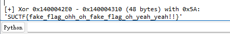

在函数表里main上一个函数如下

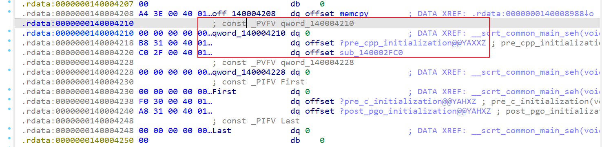

~~~c++
void __noreturn sub_140002FC0()
{
  UINT v0; // eax

  v0 = sub_140002F00();
  ExitProcess(v0);
}
__int64 __fastcall sub_140002F00(__int64 a1, __int64 a2, __int64 a3)
{
  __int64 v3; // rdx
  __int64 v4; // r8
  int v6[4]; // [rsp+20h] [rbp-A8h] BYREF
  char v7[128]; // [rsp+30h] [rbp-98h] BYREF

  v6[0] = 1;
  sub_140001020("Please input the flag: ", a2, a3);
  if ( (unsigned int)sub_140001080("%127s", v7) == 1 )
  {
    if ( (unsigned int)sub_1400020E0(v7, v6) && v6[0] == 1 )
    {
      sub_140001020("Good...\n", v3, v4);
      return 0LL;
    }
    sub_140001020("Wrong flag, bye!\n", v3, v4);
  }
  return 1LL;
}
~~~

发现这里才是真实逻辑，来分析sub_1400020E0，函数比较大，前半部分是在做一个大循环解密，可以直接动态调试到循环结束，可以看到解密出来的v39开头是MZ，这里大概率是解密出了一个PE文件

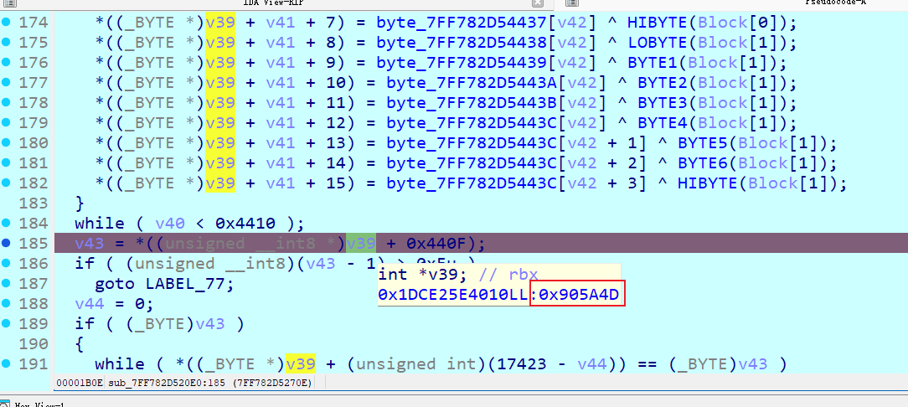

大小是0x440F，可以直接dump下来

后面的操作是一个process hollowing（进程镂空）过程，采用哈希匹配来动态调用API，需要小心的是调用了CheckRemoteDebuggerPresent，返回值修改了下一次API调用前的哈希，因此调试到这里需要patch v100的值为0

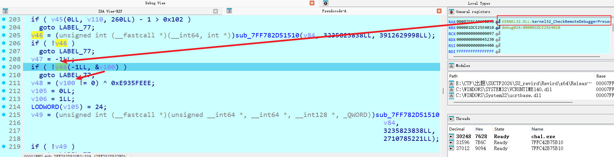

后面做的主要是读取和校验PE文件格式，Process Hollowing大致流程如下

1.	创建挂起进程（宿主是自身路径）
2.	通过管道把用户输入的 flag 写入子进程标准输入
3.	NtQueryInformationProcess 取子进程 PEB，读原始 ImageBase
4.	NtUnmapViewOfSection 卸载原映像
5.	VirtualAllocEx 分配新映像空间（优先首选基址，失败则任意地址）
6.	本地做重定位修正，WriteProcessMemory 写入 headers+sections
7.	回写子进程 PEB 的 ImageBase
8.	改线程上下文（RCX 指向新入口），ResumeThread 运行
9.	WaitForSingleObject 等待结束，GetExitCodeProcess 取退出码

之后主进程会根据退出码打印不同结果

## worker.exe

dump出来后IDA反编译很清晰

~~~c++
int __fastcall main(int argc, const char **argv, const char **envp)
{
  int v3; // edi
  FILE *v4; // rax
  size_t v5; // rax
  __int64 v6; // rbx
  HANDLE FileA; // rsi
  int v8; // r9d
  DWORD dwCreationDisposition; // [rsp+20h] [rbp-108h]
  int hTemplateFile; // [rsp+30h] [rbp-F8h]
  _DWORD v12[4]; // [rsp+40h] [rbp-E8h] BYREF
  char Buffer[128]; // [rsp+50h] [rbp-D8h] BYREF
  _BYTE Buf1[64]; // [rsp+D0h] [rbp-58h] BYREF

  v3 = 0;
  v12[0] = 0;
  v4 = _acrt_iob_func(0);
  if ( !fgets(Buffer, 128, v4) )
    return 0;
  v5 = strcspn(Buffer, "\r\n");
  if ( v5 >= 0x80 )
    sub_140002238();
  Buffer[v5] = 0;
  if ( !Buffer[0] )
    return 0;
  v6 = -1LL;
  do
    ++v6;
  while ( Buffer[v6] );
  FileA = CreateFileA("\\\\.\\Revird", 0xC0000000, 0, 0LL, 3u, 0x80u, 0LL);
  if ( FileA == (HANDLE)-1LL )
    return 0;
  if ( (unsigned int)sub_140001570(
                       (_DWORD)FileA,
                       (unsigned int)Buffer,
                       v6,
                       v8,
                       dwCreationDisposition,
                       (__int64)Buf1,
                       hTemplateFile,
                       (__int64)v12) )
  {
    CloseHandle(FileA);
    if ( v12[0] == 64 )
      LOBYTE(v3) = memcmp(Buf1, &unk_1400043C0, 0x40uLL) == 0;
    return v3;
  }
  else
  {
    CloseHandle(FileA);
    return 2;
  }
}
~~~

首先获取了输入传给Buffer，然后创建Revird链接符号，然后sub_140001570进行加密，返回结果Buf1和固定常量比较，长度为64

分析sub_140001570，因为编译开了优化，很多函数合并在了一起导致这个函数看起来非常大，可以找到多个异常函数，分别有自定义异常、int 3、div 0、memory0等异常处理

~~~c++
__int64 __fastcall exception1(__int64 a1)
{
  unsigned int *v1; // rbx

  v1 = (unsigned int *)(a1 + 64);
  *(_DWORD *)(a1 + 64) = 0;
  RaiseException(0xE0421002, 0, 0, 0LL);
  return *v1;
}
__int64 __fastcall debug_exception(__int64 a1)
{
  *(_DWORD *)(a1 + 64) = 0;
  __debugbreak();
  return *(unsigned int *)(a1 + 64);
}
__int64 __fastcall div0_exception(__int64 a1)
{
  unsigned int *v1; // rbx

  v1 = (unsigned int *)(a1 + 64);
  *(_DWORD *)(a1 + 64) = 0;
  GetCurrentThreadId();
  return *v1;
}
__int64 __fastcall memory0_exception(__int64 a1)
{
  *(_DWORD *)(a1 + 64) = 0;
  MEMORY[0] = 0x114514;
  return *(unsigned int *)(a1 + 64);
}
~~~

div0反编译看不出来需要看汇编

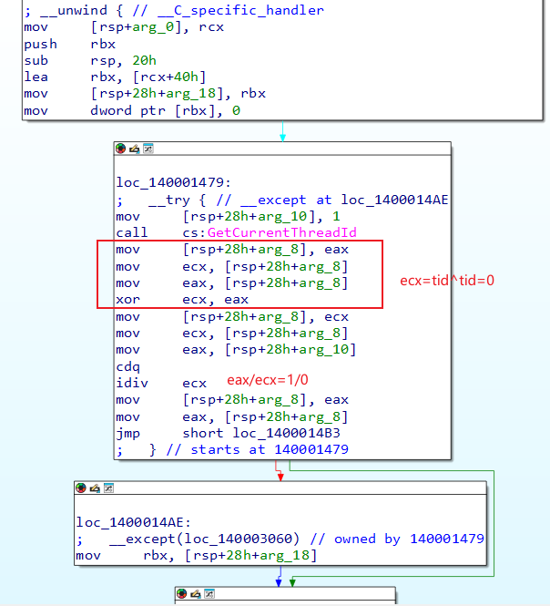

看except抛出异常都走了sub_1400012C0，其中a1是异常值，a3是一个构造的结构体

~~~c++
__int64 __fastcall sub_1400012C0(unsigned int exceptioncode, __int64 a2, __int64 a3)
{
  // [COLLAPSED LOCAL DECLARATIONS. PRESS NUMPAD "+" TO EXPAND]

  if ( *(_DWORD *)(a3 + 8) == 2 )
  {
    v4 = sub_1400011B0(a3, exceptioncode, v7);
    *(_DWORD *)(a3 + 64) = v4;
    if ( v4 )
    {
      **(_BYTE **)(a3 + 24) = *(_BYTE *)(*(unsigned __int8 *)(a3 + 48) + a3 + 68) ^ v9;
      *(_BYTE *)(*(_QWORD *)(a3 + 24) + 1LL) = *(_BYTE *)(*(unsigned __int8 *)(a3 + 49) + a3 + 68) ^ v10;
      *(_BYTE *)(*(_QWORD *)(a3 + 24) + 2LL) = *(_BYTE *)(*(unsigned __int8 *)(a3 + 50) + a3 + 68) ^ v11;
      *(_BYTE *)(*(_QWORD *)(a3 + 24) + 3LL) = *(_BYTE *)(*(unsigned __int8 *)(a3 + 51) + a3 + 68) ^ v12;
      *(_BYTE *)(*(_QWORD *)(a3 + 24) + 4LL) = *(_BYTE *)(*(unsigned __int8 *)(a3 + 52) + a3 + 68) ^ v13;
      *(_BYTE *)(*(_QWORD *)(a3 + 24) + 5LL) = *(_BYTE *)(*(unsigned __int8 *)(a3 + 53) + a3 + 68) ^ v14;
      *(_BYTE *)(*(_QWORD *)(a3 + 24) + 6LL) = *(_BYTE *)(*(unsigned __int8 *)(a3 + 54) + a3 + 68) ^ v15;
      *(_BYTE *)(*(_QWORD *)(a3 + 24) + 7LL) = *(_BYTE *)(*(unsigned __int8 *)(a3 + 55) + a3 + 68) ^ v16;
      *(_BYTE *)(*(_QWORD *)(a3 + 24) + 8LL) = *(_BYTE *)(*(unsigned __int8 *)(a3 + 56) + a3 + 68) ^ v17;
      *(_BYTE *)(*(_QWORD *)(a3 + 24) + 9LL) = *(_BYTE *)(*(unsigned __int8 *)(a3 + 57) + a3 + 68) ^ v18;
      *(_BYTE *)(*(_QWORD *)(a3 + 24) + 10LL) = *(_BYTE *)(*(unsigned __int8 *)(a3 + 58) + a3 + 68) ^ v19;
      *(_BYTE *)(*(_QWORD *)(a3 + 24) + 11LL) = *(_BYTE *)(*(unsigned __int8 *)(a3 + 59) + a3 + 68) ^ v20;
      *(_BYTE *)(*(_QWORD *)(a3 + 24) + 12LL) = *(_BYTE *)(*(unsigned __int8 *)(a3 + 60) + a3 + 68) ^ v21;
      *(_BYTE *)(*(_QWORD *)(a3 + 24) + 13LL) = *(_BYTE *)(*(unsigned __int8 *)(a3 + 61) + a3 + 68) ^ v22;
      *(_BYTE *)(*(_QWORD *)(a3 + 24) + 14LL) = *(_BYTE *)(*(unsigned __int8 *)(a3 + 62) + a3 + 68) ^ v23;
      *(_BYTE *)(*(_QWORD *)(a3 + 24) + 15LL) = *(_BYTE *)(*(unsigned __int8 *)(a3 + 63) + a3 + 68) ^ v24;
      return 1LL;
    }
  }
  else
  {
    v6 = sub_1400011B0(a3, exceptioncode, v7);
    *(_DWORD *)(a3 + 64) = v6;
    if ( v6 )
      *(_OWORD *)*(_QWORD *)(a3 + 24) = v8;
  }
  return 1LL;
}
~~~

回到大函数继续分析

1. 函数开头部分使用一组256字节常量做了运算，分析可知是AES的密钥扩展，可以获取密钥为`xmmword_140004400 xmmword 20F18933C50D6AB2E4583D7F902C4A11h`

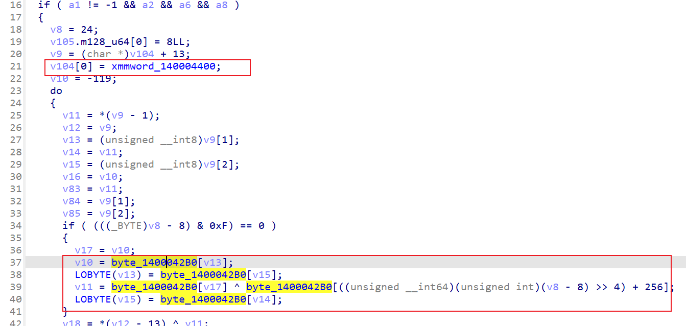

2. 密钥扩展完开始pkcs7 padding

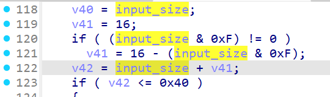

3. 接着是LCG生成了256字节数组

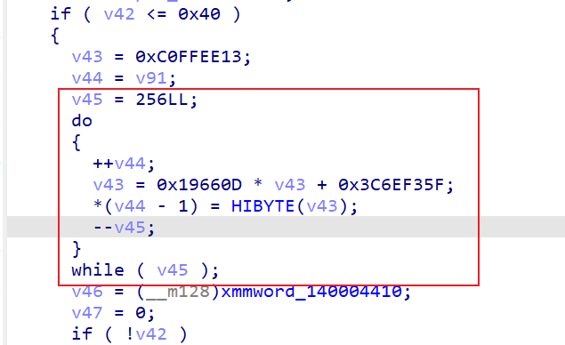

4. 接着又取了一组16字节常量（赋值给了v46）和输入异或，可知是AES中的iv

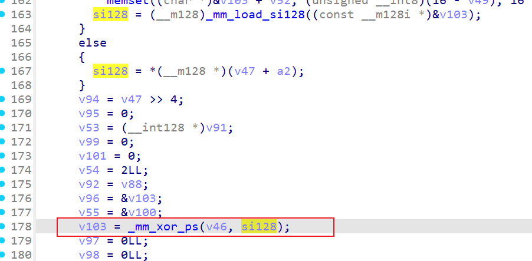

5. add round key异或，v102[0]正好是第0轮异或

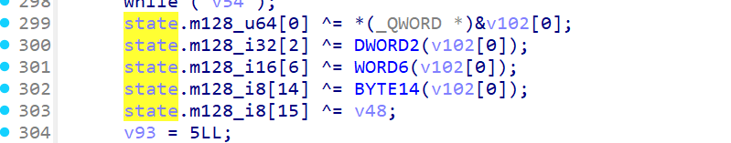

6. 触发debug异常（debug_exception，opcode5）
7. 进入一组大循环（9轮），发现每次异常前都会做一个赋值操作，类似opcode，每次exception都会传入一个结构体（v92）

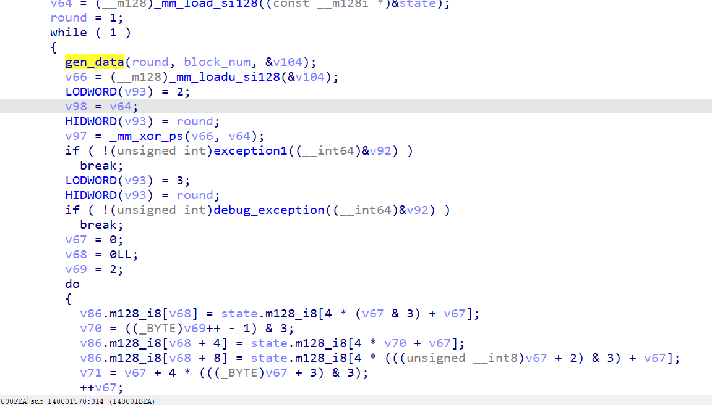

	* 循环里首先是gen_data生成一组数据和state异或，结果传入到了结构体中，触发了自定义异常（exception1，opcode2）
	* 触发debug异常（debug_exception，opcode3）
	* 接着是shiftrow

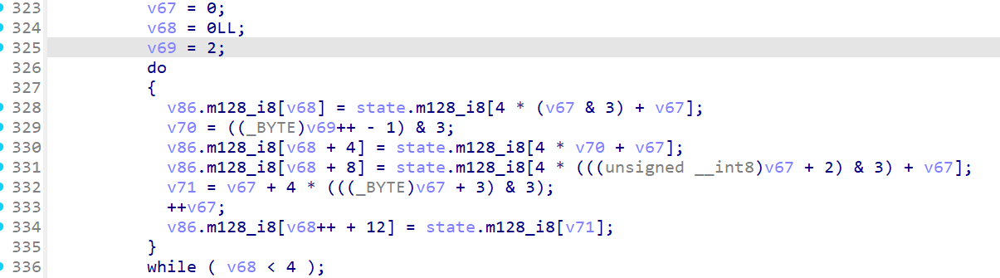

	* 触发除0异常（div0_exception，opcode4）
	* add round key异或第round轮轮密钥

8. 循环出来后（round>9），做的基本和循环里类似，符合AES的round 10，但是多了个触发访问0内存异常

### R0-R3通信

通信代码在异常处理函数里，构造了结构体InBuffer

~~~c++
__int64 __fastcall sub_1400011B0(__int64 a1, int a2, _OWORD *a3)
{
  __int128 v3; // xmm1
  __int128 *v5; // rax
  void *v6; // rcx
  __int128 v7; // xmm0
  __int128 v8; // xmm1
  __int128 v9; // xmm0
  DWORD BytesReturned[4]; // [rsp+40h] [rbp-39h] BYREF
  _DWORD InBuffer[5]; // [rsp+50h] [rbp-29h] BYREF
  __int64 v13; // [rsp+64h] [rbp-15h]
  _BYTE v14[36]; // [rsp+6Ch] [rbp-Dh] BYREF
  __int128 OutBuffer; // [rsp+90h] [rbp+17h] BYREF
  __int128 v16; // [rsp+A0h] [rbp+27h]
  __int128 v17; // [rsp+B0h] [rbp+37h]

  v3 = *(_OWORD *)(a1 + 32);
  InBuffer[2] = *(_DWORD *)(a1 + 8);
  InBuffer[3] = *(_DWORD *)(a1 + 12);
  InBuffer[4] = *(_DWORD *)(a1 + 16);
  v5 = *(__int128 **)(a1 + 24);
  v6 = *(void **)a1;
  memset(&v14[16], 0, 20);
  *(_OWORD *)v14 = 0uLL;
  BytesReturned[0] = 0;
  v13 = 0LL;
  InBuffer[1] = a2;
  OutBuffer = 0LL;
  InBuffer[0] = 'REVI';
  v16 = 0LL;
  v17 = 0LL;
  v7 = *v5;
  *(_OWORD *)&v14[20] = v3;
  *(_OWORD *)&v14[4] = v7;
  if ( !DeviceIoControl(v6, 0x222000u, InBuffer, 0x40u, &OutBuffer, 0x30u, BytesReturned, 0LL)
    || BytesReturned[0] < 0x30
    || (_DWORD)OutBuffer )
  {
    return 0LL;
  }
  if ( a3 )
  {
    v8 = v16;
    *a3 = OutBuffer;
    v9 = v17;
    a3[1] = v8;
    a3[2] = v9;
  }
  return 1LL;
}
~~~

调试可以在这里拿到结构体的前几个字段

~~~c++
struct R0_Packet {
    uint32_t magic; // 'IVER'
    uint32_t exception_code;
    uint32_t opcode;
    uint32_t round;
    ...
    uint8_t State[16];
    uint8_t data[16];
};
~~~

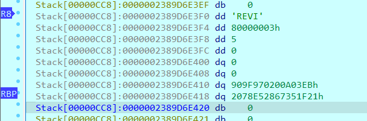

交叉引用这个函数到上一层会发现opcode 2会单独做一个额外异或运算

## Revird.sys

下面分析驱动，IDA反编译发现代码里加了一些常数变量来混淆代码（当然起的作用很小就是了），可以直接找DeviceIoControl通信

~~~c++
__int64 __fastcall sub_140001B20(__int64 a1, __int64 a2)
{
  __int64 v2; // rdx
  int v4; // [rsp+20h] [rbp-28h]
  int v5; // [rsp+24h] [rbp-24h]
  int v6; // [rsp+28h] [rbp-20h]
  int v7; // [rsp+2Ch] [rbp-1Ch]
  _DWORD *Event; // [rsp+38h] [rbp-10h]

  Event = CAMSchedule::GetEvent((CAMSchedule *)a2);
  v7 = sub_1400012B4(Event[6] == 0x222000);
  v4 = byte_140004005;
  v6 = (char)sub_140001008((unsigned int)byte_140004005, v2) + v4;
  v5 = 2 * (char)sub_140001004();
  if ( (((char)sub_140001000() * v5 + v6) / (unsigned int)byte_140004004 - byte_140004000) * v7 )
    return sub_140001D64(a2, Event);
  *(_DWORD *)(a2 + 48) = 0xC0000010;
  *(_QWORD *)(a2 + 56) = 0LL;
  IofCompleteRequest((PIRP)a2, 0);
  return 0xC0000010LL;
}
~~~

核心是sub_140001D64，要求检查magic为`IVER`，满足才能进入运算环节

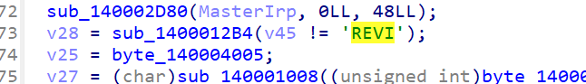

驱动层为了提高真人做题的体验，把优化关闭了，混淆的不是很复杂，switch能看到比较值有2、3、4、5、6，正好对上R0层的opcode

### opcode 2

首先调用了和R0相同的gen_data，然后sbox取值

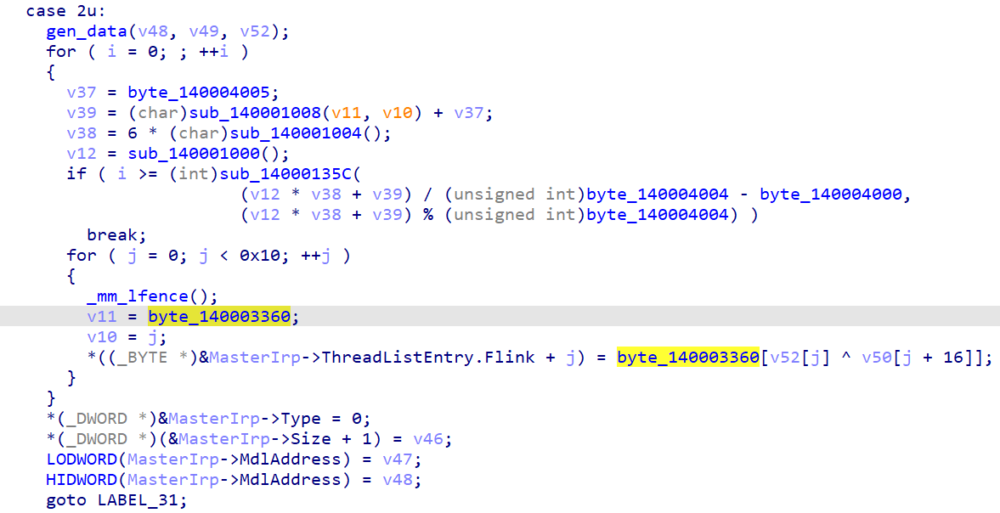

### opcode 3

比较明显是ShiftRows

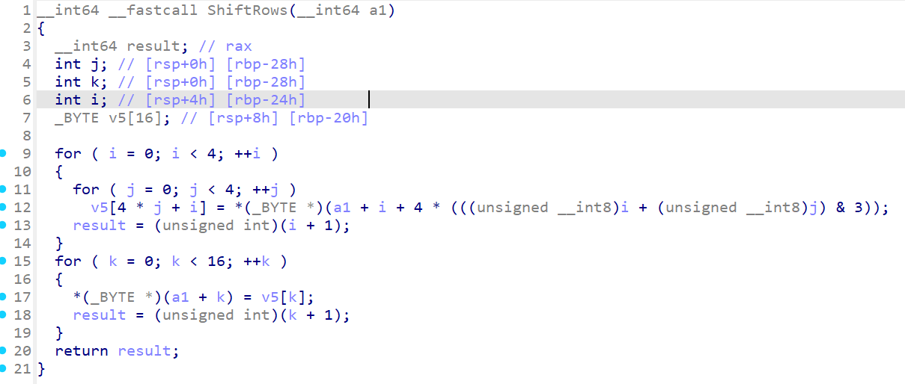

### opcode 4-6

opcode 4多了个MixColumns，4、5、6都有一个异或

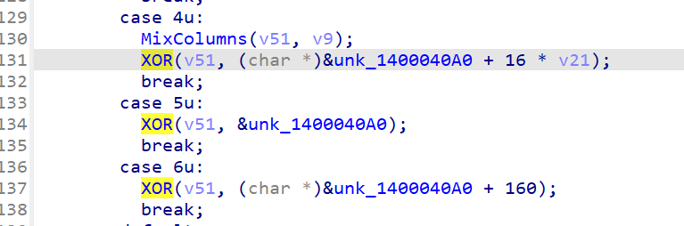

unk_1400040A0交叉引用可以发现在DriverEntry里由sub_1400014B0初始化了，分析可知是密钥扩展

## R0+R3

把R0+R3的代码连起来逻辑如下

~~~
state ^= worker_roundkey[0]		// R3 
state ^= driver_roundkey[0]		// R0 opcode 5
for round = 1..9:
    state = SBox(state)			// R0+R3 opcode 2
    state = ShiftRows(state) 	// R0 opcode 3
    state = ShiftRows(state) 	// R3
    state = MixColumns(state)	// R0 opcode 4
    state ^= driver_roundkey[round]	// R0 opcode 4
    state ^= worker_roundkey[round]	// R3
state = SBox(state)				// R0+R3 opcode 2
state = ShiftRows(state)		// R0 opcode 3
state = ShiftRows(state)		// R3
state ^= driver_roundkey[10]	// R0 opcode 6
state ^= worker_roundkey[10]	// R3
~~~

解密脚本如下

~~~python
STD_SBOX = [
    0x3a, 0x75, 0x60, 0x18, 0x0e, 0xdc, 0x36, 0x06, 0xa9, 0xad, 0x45, 0xd8, 0xef, 0xfe, 0x5e, 0x90,
    0xe9, 0xb1, 0x95, 0x72, 0xf4, 0xdb, 0x51, 0x0b, 0x46, 0x59, 0x34, 0x92, 0x6a, 0x50, 0xd6, 0xc8,
    0xab, 0x63, 0x2b, 0x78, 0x30, 0xf1, 0xd0, 0x2f, 0x61, 0x58, 0x4f, 0x25, 0x9b, 0xf8, 0x01, 0x42,
    0x16, 0x1e, 0xb4, 0xac, 0xbd, 0x5c, 0xe0, 0x73, 0x62, 0xe2, 0xe7, 0x37, 0xd2, 0x7a, 0x28, 0x84,
    0xe5, 0x55, 0xa8, 0xb2, 0xc4, 0xdd, 0x2d, 0xa4, 0x69, 0xf2, 0xe3, 0x14, 0x22, 0xa7, 0xd5, 0xbb,
    0xda, 0x83, 0x54, 0x7e, 0x9d, 0xb0, 0x31, 0xb5, 0x68, 0x8c, 0x2a, 0x87, 0xa5, 0x7d, 0x33, 0x11,
    0x9a, 0x20, 0xfa, 0x88, 0x44, 0x86, 0x12, 0x19, 0x81, 0x77, 0xb6, 0xb7, 0xe1, 0xd4, 0x23, 0x48,
    0x3f, 0x74, 0x32, 0xca, 0x02, 0x4c, 0x5a, 0x89, 0xfd, 0xba, 0xa2, 0x21, 0x09, 0x5d, 0x85, 0x6b,
    0x03, 0x0a, 0xf0, 0xcb, 0xc1, 0x8b, 0x1a, 0xaf, 0xe4, 0x4d, 0x29, 0x0d, 0x99, 0x08, 0xcd, 0xd9,
    0xaa, 0x24, 0xa6, 0x39, 0xfb, 0x38, 0xff, 0x1f, 0x1b, 0xd7, 0x49, 0x8e, 0x2e, 0x3b, 0xde, 0xbc,
    0x57, 0xce, 0xf9, 0x53, 0x40, 0x5f, 0x47, 0x4b, 0xeb, 0xc2, 0x4a, 0x97, 0x3d, 0x0c, 0x17, 0x5b,
    0x65, 0xc6, 0xcc, 0x7b, 0xbe, 0xf6, 0x41, 0xf5, 0x98, 0xa0, 0xfc, 0x4e, 0xe8, 0x91, 0x93, 0x9e,
    0x71, 0x7f, 0xb9, 0x0f, 0xd3, 0xec, 0xc7, 0x96, 0x00, 0x6c, 0x94, 0xa3, 0xc5, 0x79, 0x43, 0x3e,
    0xa1, 0xae, 0xc9, 0x04, 0x9f, 0x6d, 0xb3, 0x7c, 0xc3, 0x2c, 0xee, 0xcf, 0x8a, 0x80, 0x1d, 0xe6,
    0x52, 0x27, 0x9c, 0x66, 0xbf, 0x35, 0x26, 0x10, 0xdf, 0x15, 0xb8, 0x13, 0x07, 0x6e, 0x8f, 0xea,
    0xc0, 0x1c, 0x67, 0x8d, 0xed, 0x6f, 0xd1, 0x3c, 0x70, 0x76, 0xf3, 0x64, 0xf7, 0x56, 0x05, 0x82
]

RCON = [0, 0x03, 0x06, 0x0c, 0x18, 0x30, 0x60, 0xc0, 0x9b, 0x2d, 0x5a]

def expand_key(key_bytes):
    rk = list(key_bytes)
    for i in range(1, 11):
        prev = rk[-4:]
        w_new = [STD_SBOX[prev[1]] ^ RCON[i], STD_SBOX[prev[2]], STD_SBOX[prev[3]], STD_SBOX[prev[0]]]
        for j in range(4): rk.append(rk[-16] ^ w_new[j])
        for _ in range(3):
            for j in range(4): rk.append(rk[-16] ^ rk[-4])
    return rk

def get_custom_sbox():
    sbox_share_a = bytearray(256)
    s = 0xC0FFEE13
    a = 1664525
    c = 1013904223
    for i in range(256):
        s = (a * s + c) & 0xFFFFFFFF
        sbox_share_a[i] = s >> 24

    g_sbox_share_b = bytes([
        0xED, 0xC2, 0xBD, 0xAA, 0x2B, 0x7E, 0xD6, 0x42, 0x8C, 0xB1, 0x30, 0x74, 0xBB, 0x8C, 0x9B, 0x21,
        0xE9, 0x79, 0xC6, 0x77, 0x4B, 0xE4, 0x93, 0x71, 0x92, 0x8C, 0x8F, 0x51, 0x56, 0x4A, 0x67, 0x67,
        0x7C, 0xBC, 0x19, 0x18, 0x9D, 0x08, 0x9D, 0x93, 0x4B, 0xF4, 0x37, 0x94, 0x5D, 0x4E, 0x69, 0xFD,
        0x27, 0xCE, 0x46, 0x74, 0x98, 0xE7, 0xC0, 0x29, 0xA7, 0xC3, 0x8A, 0x3A, 0xB7, 0xB2, 0xD3, 0xE0,
        0x6E, 0xB4, 0x2D, 0x17, 0x0D, 0xEE, 0x3C, 0x76, 0x7D, 0x5E, 0xA0, 0xE7, 0x4B, 0x7C, 0xA0, 0x06,
        0x2A, 0xBB, 0x64, 0x95, 0x24, 0x2C, 0xC8, 0xB0, 0x1E, 0x7B, 0xEA, 0x8C, 0x42, 0x9F, 0xFD, 0x0B,
        0xD6, 0x05, 0xF4, 0xDA, 0x2B, 0x8C, 0x8A, 0x66, 0xB1, 0x34, 0xC5, 0x97, 0x84, 0x3C, 0x22, 0x38,
        0x25, 0x3A, 0x11, 0xF5, 0xFC, 0x51, 0x6E, 0xAF, 0x5B, 0x1F, 0x0C, 0xAB, 0x5E, 0x1D, 0x7E, 0xE3,
        0x35, 0xD8, 0x01, 0x3E, 0xE2, 0x38, 0x07, 0x7D, 0xAA, 0x42, 0xCE, 0x24, 0x9E, 0xE0, 0x49, 0x2F,
        0x0F, 0xA2, 0x3E, 0x19, 0xEC, 0x27, 0x95, 0xE6, 0x46, 0x8D, 0x90, 0xFE, 0x89, 0x35, 0xBD, 0xAB,
        0xC3, 0x7C, 0xBA, 0xF9, 0xE5, 0x9F, 0xFC, 0x46, 0xCC, 0xD5, 0x32, 0x59, 0x49, 0x0C, 0x7B, 0x81,
        0x7E, 0x32, 0x74, 0xDA, 0x3F, 0x8E, 0x6A, 0xC0, 0xF8, 0xC9, 0x5B, 0xA0, 0x7F, 0xBD, 0x0D, 0x14,
        0x42, 0x03, 0x39, 0x9C, 0xD6, 0xBA, 0xCB, 0x91, 0xCA, 0xA0, 0x1A, 0x49, 0x33, 0x9C, 0x7C, 0xD3,
        0x5C, 0x7D, 0x97, 0xB6, 0xA2, 0x6C, 0x0A, 0xBE, 0x93, 0x88, 0x4C, 0xED, 0xA4, 0x49, 0x41, 0x9B,
        0x42, 0x84, 0xF9, 0x93, 0xCD, 0xB1, 0xF2, 0x0C, 0x78, 0x1D, 0x1D, 0xB7, 0x0A, 0x88, 0xE9, 0x11,
        0xCB, 0x68, 0x4D, 0x83, 0x09, 0xCF, 0xE1, 0x2C, 0x2F, 0x19, 0xB2, 0x90, 0xED, 0x04, 0x28, 0xE2
    ])

    return [a ^ b for a, b in zip(sbox_share_a, g_sbox_share_b)]

def shift_rows(s):
    tmp = [0] * 16
    for row in range(4):
        for col in range(4):
            tmp[row + 4 * col] = s[row + 4 * ((col + row) % 4)]
    return tmp

def inv_shift_rows(s):
    tmp = [0] * 16
    for row in range(4):
        for col in range(4):
            tmp[row + 4 * col] = s[row + 4 * ((col - row + 4) % 4)]
    return tmp

def xtime(a):
    return ((a << 1) ^ 0x1b) & 0xFF if (a & 0x80) else (a << 1)

def mult(a, b):
    res = 0
    for _ in range(8):
        if b & 1: res ^= a
        a = xtime(a)
        b >>= 1
    return res

def mix_single_column(a):
    t = a[0] ^ a[1] ^ a[2] ^ a[3]
    return [
        a[0] ^ t ^ xtime(a[0] ^ a[1]),
        a[1] ^ t ^ xtime(a[1] ^ a[2]),
        a[2] ^ t ^ xtime(a[2] ^ a[3]),
        a[3] ^ t ^ xtime(a[3] ^ a[0])
    ]

def mix_columns(s):
    out = list(s)
    for i in range(4):
        c = mix_single_column([s[i * 4 + 0], s[i * 4 + 1], s[i * 4 + 2], s[i * 4 + 3]])
        out[i * 4:i * 4 + 4] = c
    return out

def inv_mix_single_column(a):
    return [
        mult(a[0], 14) ^ mult(a[1], 11) ^ mult(a[2], 13) ^ mult(a[3], 9),
        mult(a[0], 9) ^ mult(a[1], 14) ^ mult(a[2], 11) ^ mult(a[3], 13),
        mult(a[0], 13) ^ mult(a[1], 9) ^ mult(a[2], 14) ^ mult(a[3], 11),
        mult(a[0], 11) ^ mult(a[1], 13) ^ mult(a[2], 9) ^ mult(a[3], 14)
    ]

def inv_mix_columns(s):
    out = list(s)
    for i in range(4):
        c = inv_mix_single_column([s[i * 4 + 0], s[i * 4 + 1], s[i * 4 + 2], s[i * 4 + 3]])
        out[i * 4:i * 4 + 4] = c
    return out

def magic_aes_encrypt_block(pt, rk_eff, my_sbox):
    state = list(pt)
    state = [st ^ k for st, k in zip(state, rk_eff[0:16])]

    for round_idx in range(1, 10):
        state = [my_sbox[b] for b in state]
        state = shift_rows(shift_rows(state))
        state = mix_columns(state)
        state = [st ^ k for st, k in zip(state, rk_eff[round_idx * 16: round_idx * 16 + 16])]

    state = [my_sbox[b] for b in state]
    state = shift_rows(shift_rows(state))
    state = [st ^ k for st, k in zip(state, rk_eff[160:176])]
    return bytes(state)

def magic_aes_decrypt_block(ct, rk_eff, inv_sbox):
    state = list(ct)
    state = [st ^ k for st, k in zip(state, rk_eff[160:176])]
    state = inv_shift_rows(inv_shift_rows(state))
    state = [inv_sbox[b] for b in state]

    for round_idx in range(9, 0, -1):
        state = [st ^ k for st, k in zip(state, rk_eff[round_idx * 16: round_idx * 16 + 16])]
        state = inv_mix_columns(state)
        state = inv_shift_rows(inv_shift_rows(state))
        state = [inv_sbox[b] for b in state]

    state = [st ^ k for st, k in zip(state, rk_eff[0:16])]
    return bytes(state)

if __name__ == "__main__":
    key_a = bytes([0x11, 0x4A, 0x2C, 0x90, 0x7F, 0x3D, 0x58, 0xE4, 0xB2, 0x6A, 0x0D, 0xC5, 0x33, 0x89, 0xF1, 0x20])
    key_b = bytes([0x63, 0xA9, 0x41, 0x27, 0x0E, 0xD4, 0x96, 0x12, 0x58, 0xC0, 0xB3, 0x7A, 0x9D, 0x16, 0x24, 0xE8])
    iv = bytes([0x9B, 0x28, 0x47, 0xD1, 0x6E, 0xA5, 0x30, 0x8C, 0xF2, 0x14, 0x59, 0xC3, 0x7A, 0x0D, 0xE8, 0x61])

    rkA = expand_key(key_a)
    rkB = expand_key(key_b)
    EFF_RK = [a ^ b for a, b in zip(rkA, rkB)]

    MY_SBOX = get_custom_sbox()
    INV_SBOX = [0] * 256
    for i, v in enumerate(MY_SBOX): INV_SBOX[v] = i

    prev = iv
    cipher = bytes([55, 60, 97, 90, 55, 65, 25, 193, 166, 196, 220, 210, 144, 206, 192, 82, 157, 251, 178, 115, 252, 134, 58, 237, 45, 175, 78, 122, 96, 0, 67, 108, 212, 92, 200, 100, 127, 64, 30, 152, 166, 127, 221, 106, 119, 14, 172, 26, 231, 219, 202, 171, 60, 63, 10, 70, 66, 138, 148, 168, 129, 251, 151, 136])
    decrypted = b""
    for i in range(0, len(cipher), 16):
        block = cipher[i:i + 16]
        dec_block = magic_aes_decrypt_block(block, EFF_RK, INV_SBOX)
        dec_block = bytes(b ^ p for b, p in zip(dec_block, prev))
        decrypted += dec_block
        prev = block

    pad_val = decrypted[-1]
    msg = decrypted[:-pad_val]
    print(decrypted[:-pad_val])
~~~

flag为`SUCTF{D0_y0U_unD3r5t4nd_Th15_m491c4l_435?_41218}`

这道题一个主要考点就是AES魔改

1. 把AES的key拆分开，分别给R0、R3，各自利用自己的key生成轮密钥，最后二者的轮密钥异或才得到真正轮密钥
2. 利用opcode把一些操作拆分或合并
3. 多加了一层ShiftRows